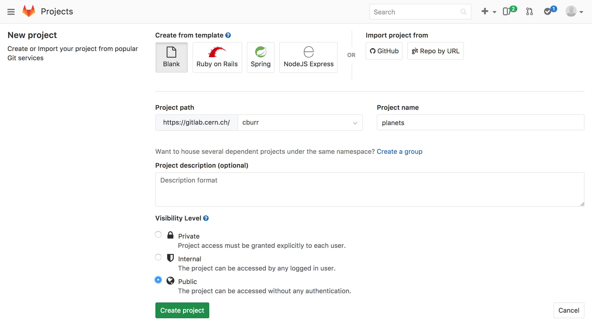
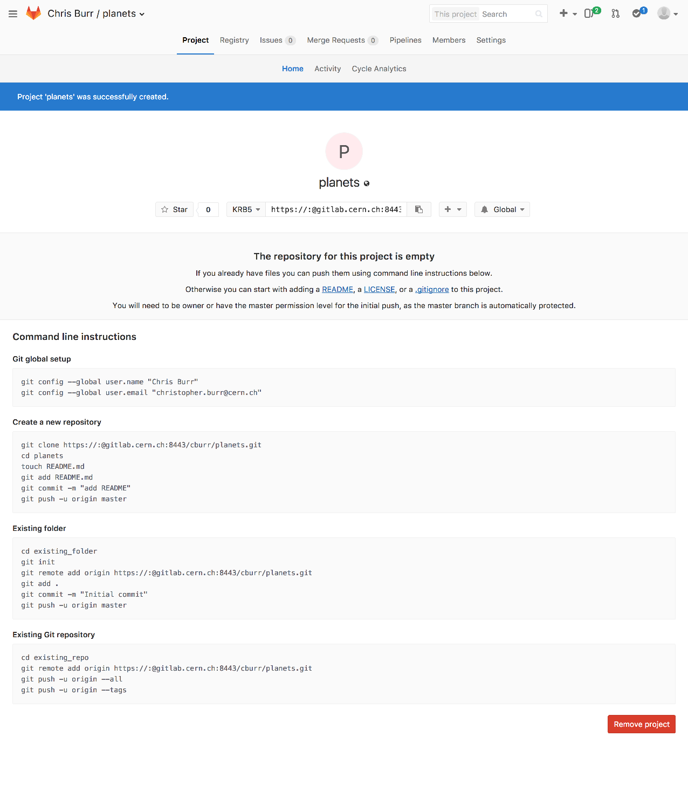

# Remotes in CERN GitLab



- Explain what remote repositories are and why they are useful.
- Push to or pull from a remote repository.





- A SSH Key added to your CERN GitLab account, see [here](https://docs.gitlab.com/ce/ssh/README.html)
  for instructions.
- You can test if this is working by runnning `ssh git@gitlab.cern.ch -T -p 7999`.
  Everything is working correctly if the output of the command is:

```
Welcome to GitLab, Santa Claus!
```



Version control really comes into its own when we begin to collaborate with
other people.  We already have most of the machinery we need to do this; the
only thing missing is to copy changes from one repository to another.

Systems like Git allow us to move work between any two repositories.  In
practice, though, it's easiest to use one copy as a central hub, and to keep it
on the web rather than on someone's laptop.  Most programmers use hosting
services like [GitHub](https://github.com), [BitBucket](https://bitbucket.org) or
[GitLab](https://gitlab.com/) to hold those master copies. All of these services
are the same from the perspective of the git command line however each
provider's website offers slightly different features. In this lesson we will
use [CERN's instance of GitLab](https://gitlab.cern.ch/). This is the similar to
the public GitLab instance except it is hosted by CERN and is integrated with
various CERN services such as [Single Sign On](https://information-technology.web.cern.ch/services/SSO-Service)
and [JIRA](https://information-technology.web.cern.ch/services/JIRA-service).

Let's start by sharing the changes we've made to our current project with the
world.  Log in to [CERN GitLab](https://gitlab.cern.ch/), then click on the +
icon in the top right and create a new project called `planets`:


Name your repository "planets" and then click "Create project":



Here we can see one of the main reasons why you might want to use GitLab at CERN
instead of an external service: every CERN user can create a *private*
repository, meaning its access can be restricted to the persons you want.
External services such as [GitHub](https://github.com) only allow you to create
*public repositories* [unless you pay for it](https://github.com/pricing). Note
that private repositories are very useful when collaborating for a paper.

As soon as the repository is created, GitLab displays a page with a URL and some
information on how to configure your local repository:



This is roughly equivalent to perform the following on CERN's servers:

```bash
$ mkdir planets
$ cd planets
$ git init --bare
```

Our local repository still contains our earlier work on `mars.txt`, but the
remote repository on CERN GitLab doesn't contain any files yet:


The next step is to connect the two repositories.  We do this by making the
GitLab repository a remote for the local repository.
The home page of the repository on GitLab includes the string we need to
identify it:


Click on the 'SSH' link to change the protocol from
KRB5 to SSH and then copy that URL from the browser, go into the local `planets`
repository, and run this command:

```bash
$ git remote add origin ssh://git@gitlab.cern.ch:7999/vlad/planets.git
```

Make sure to use the URL for your repository rather than Vlad's: the only
difference should be your username instead of `vlad`.

We can check that the command has worked by running `git remote -v`:

```bash
$ git remote -v
```
```
origin  ssh://git@gitlab.cern.ch:7999/vlad/planets.git (fetch)
origin  ssh://git@gitlab.cern.ch:7999/vlad/planets.git (push)
```

The name `origin` is a local nickname for your remote repository. We could use
something else if we wanted to, but `origin` is by far the most common choice.

Once the nickname `origin` is set up, this command will push the changes from
our local repository to the repository on GitLab:

```bash
$ git push origin master
```
```
Counting objects: 9, done.
Delta compression using up to 4 threads.
Compressing objects: 100% (6/6), done.
Writing objects: 100% (9/9), 821 bytes, done.
Total 9 (delta 2), reused 0 (delta 0)
To ssh://gitlab.cern.ch:7999/vlad/planets.git
 * [new branch]      master -> master
Branch master set up to track remote branch master from origin.
```

Our local and remote repositories are now in this state:





You may see a `-u` option used with `git push` in some documentation.  This
option is synonymous with the `--set-upstream-to` option for the `git branch`
command, and is used to associate the current branch with a remote branch so
that the `git pull` command can be used without any arguments. To do this,
simply use `git push -u origin master` once the remote has been set up.



We can pull changes from the remote repository to the local one as well:

```bash
$ git pull origin master
```
```
From https://gitlab.cern.ch/vlad/planets
 * branch            master     -> FETCH_HEAD
Already up-to-date.
```

Pulling has no effect in this case because the two repositories are already
synchronized.  If someone else had pushed some changes to the repository on
GitLab, though, this command would download them to our local repository.




Browse to your `planets` repository on GitLab.
Under the "Repository" tab, find and click on the text that says "Commits".

Hover over, and click on, the three buttons to the right of each commit.
What information can you gather/explore from these buttons?
How would you get that same information in the shell?



The button with the picture of a clipboard copies the full
identifier of the commit to the clipboard. In the shell, ```git log``` will show
you the full commit identifier for each commit.

When you click on the commit message, you'll see all of the changes that were
made in that particular commit. Green shaded lines indicate additions and red
ones removals. In the shell we can do the same thing with ```git diff```. In
particular, ```git diff ID1..ID2``` where ID1 and ID2 are commit identifiers
(e.g. ```git diff a3bf1e5..041e637```) will show the differences between those
two commits.

The right-most button ("Browse files") lets you view all of the files in the repository at the
time of that commit. To do this in the shell, we'd need to checkout the
repository at that particular time. We can do this with ```git checkout ID```
where ID is the identifier of the commit we want to look at. If we do this, we
need to remember to put the repository back to the right state afterwards!








Create a remote repository on GitLab.  Push the contents of your local
repository to the remote.  Make changes to your local repository and push
these changes.  Go to the repo you just created on GitLab and check the
timestamps of the files.  How does
GitLab record times, and why?



GitLab displays timestamps in a human readable relative format (i.e.
"22 hours ago" or "three weeks ago"). However, if you hover over the timestamp,
you can see the exact time at which the last change to the file occurred.








In this lesson, we introduced the "git push" command.
How is "git push" different from "git commit"?



When we push changes, we're interacting with a remote repository to update it
with the changes we've made locally (often this corresponds to sharing the
changes we've made with others). Commit only updates your local repository.








It happens quite often in practice that you made a typo in the
remote URL. This exercise is about how to fix this kind of issues.
First start by adding a remote with an invalid URL:

```
git remote add broken https://gitlab.cern.ch/this/url/is/invalid
```

Do you get an error when adding the remote? Can you think of a
command that would make it obvious that your remote URL was not
valid? Can you figure out how to fix the URL (tip: use `git remote
-h`)? Don't forget to clean up and remove this remote once you are
done with this exercise.



We don't see any error message when we add the remote (adding the remote tells
git about it, but doesn't try to use it yet). As soon as we try to use
```git push``` we'll see an error message. The command ```git remote set-url```
allows us to change the remote's URL to fix it.







- A local Git repository can be connected to one or more remote repositories.
- Use the SSH protocol to connect to remote repositories.
- `git push` copies changes from a local repository to a remote repository.
- `git pull` copies changes from a remote repository to a local repository.



 [CC BY 4.0](https://creativecommons.org/licenses/by/4.0/legalcode) - Based on [git-novice](https://github.com/swcarpentry/git-novice) © 2016–2017 Software Carpentry Foundation 

