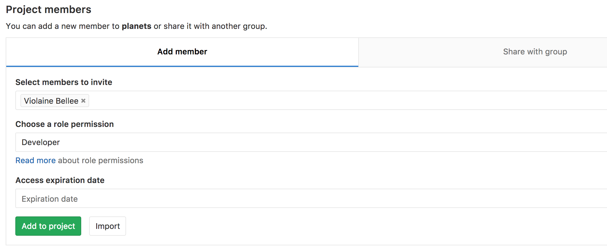

# Sharing a repository with others



- Clone a remote repository.
- Collaborate pushing to a common repository.



For the next step, get into pairs.  One person will be the "Owner" and the other
will be the "Collaborator". The goal is that the Collaborator add changes into
the Owner's repository. We will switch roles at the end, so both persons will
play Owner and Collaborator.



If you're working through this lesson on your own, you can carry on by opening
a second terminal window.
This window will represent your partner, working on another computer. You
won't need to give anyone access on GitLab, because both 'partners' are you.



The Owner needs to give the Collaborator access.  On GitLab, click the
"Members" tab at the top, and enter your partner's username.





GitLab permission levels might be complicated to understand. [This
table](https://docs.gitlab.com/ee/user/permissions.html) might come in handy.



Next, the Collaborator needs to download a copy of the Owner's repository to
her machine. This is called "cloning a repo". To clone the Owner's repo into
her `Desktop` folder, the Collaborator enters:

```bash
$ git clone ssh://git@gitlab.cern.ch:7999/vlad/planets.git ~/Desktop/vlad-planets
```

Replace `vlad` with the Owner's username.


The Collaborator can now make a change in her clone of the Owner's repository,
exactly the same way as we've been doing before:

```bash
$ cd ~/Desktop/vlad-planets
$ nano pluto.txt
$ cat pluto.txt
```
```
It is so a planet!
```

```bash
$ git add pluto.txt
$ git commit -m "Add notes about Pluto"
```
```
 1 file changed, 1 insertion(+)
 create mode 100644 pluto.txt
```

Then push the change to the *Owner's repository* on GitLab:

```bash
$ git push origin master
```
```
Counting objects: 4, done.
Delta compression using up to 4 threads.
Compressing objects: 100% (2/2), done.
Writing objects: 100% (3/3), 306 bytes, done.
Total 3 (delta 0), reused 0 (delta 0)
To ssh://gitlab.cern.ch:7999/vlad/planets.git
   9272da5..29aba7c  master -> master
```

Note that we didn't have to create a remote called `origin`: Git uses this name
by default when we clone a repository.  (This is why `origin` was a sensible
choice earlier when we were setting up remotes by hand.)

Take a look to the Owner's repository on its GitLab website now (maybe you need
to refresh your browser.) You should be able to see the new commit made by the
Collaborator.

To download the Collaborator's changes from GitLab, the Owner now enters:

```bash
$ git pull origin master
```
```
remote: Counting objects: 4, done.
remote: Compressing objects: 100% (2/2), done.
remote: Total 3 (delta 0), reused 3 (delta 0)
Unpacking objects: 100% (3/3), done.
From ssh://gitlab.cern.ch:7999/vlad/planets.git
 * branch            master     -> FETCH_HEAD
Updating 9272da5..29aba7c
Fast-forward
 pluto.txt | 1 +
 1 file changed, 1 insertion(+)
 create mode 100644 pluto.txt
```

Now the three repositories (Owner's local, Collaborator's local, and Owner's on
GitLab) are back in sync.



In practice, it is good to be sure that you have an updated version of the
repository you are collaborating on, so you should `git pull` before making
our changes. The basic collaborative workflow would be:

* update your local repo with `git pull origin master`,
* make your changes and stage them with `git add`,
* commit your changes with `git commit -m`, and
* upload the changes to GitLab with `git push origin master`

It is better to make many commits with smaller changes rather than
of one commit with massive changes: small commits are easier to
read and review.





Switch roles and repeat the whole process.





The Owner push commits to the repository without giving any information
to the Collaborator. How can the Collaborator find out what has changed with
command line? And on GitLab?


On the command line, the Collaborator can use ```git fetch origin master```
to get the remote changes into the local repository, but without merging
them. Then by running ```git diff master origin/master``` the Collaborator
will see the changes output in the terminal.

On GitLab, the Collaborator can go to their own fork of the repository and
look right above the light blue latest commit bar for a gray bar saying
"This branch is 1 commit behind Our-Respository:master." On the far right of
that gray bar is a Compare icon and link. On the Compare page the
Collaborator should change the base fork to their own repository, then click
the link in the paragraph above to "compare across forks", and finally
change the head fork to the main repository. This will show all the commits
that are different.







The Collaborator has some questions about one line change made by the Owner and
has some suggestions to propose.

With GitLab, it is possible to comment the diff of a commit. Over the line of
code to comment, a blue comment icon appears to open a comment window.

The Collaborator posts its comments and suggestions using GitLab interface.




Some backup software can keep a history of the versions of your files. They also
allows you to recover specific versions. How is this functionality different from version control?
What are some of the benifits of using version control, Git and GitLab?





- `git clone` copies a remote repository to create a local repository with a remote called `origin` automatically set up.



 [CC BY 4.0](https://creativecommons.org/licenses/by/4.0/legalcode) - Based on [git-novice](https://github.com/swcarpentry/git-novice) © 2016–2017 Software Carpentry Foundation 

