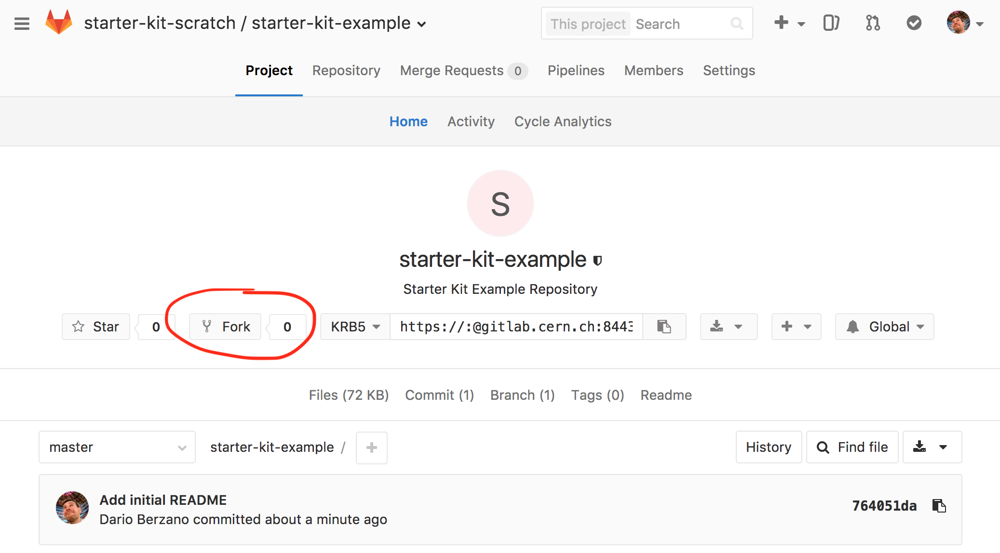
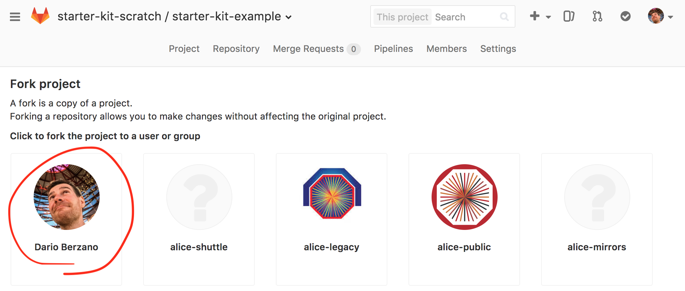
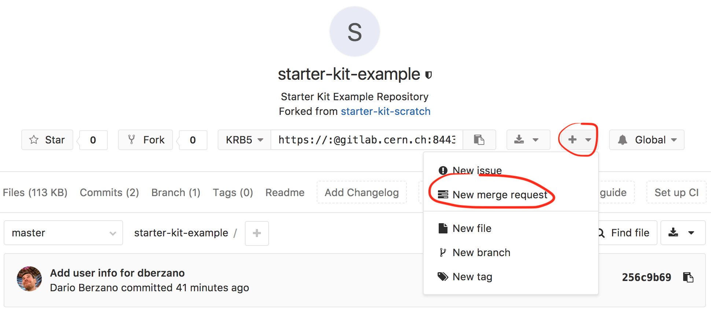
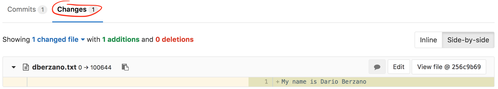
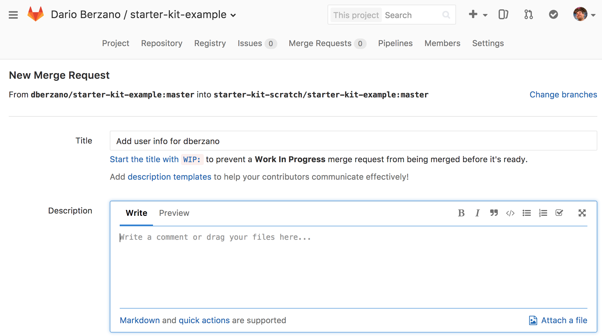
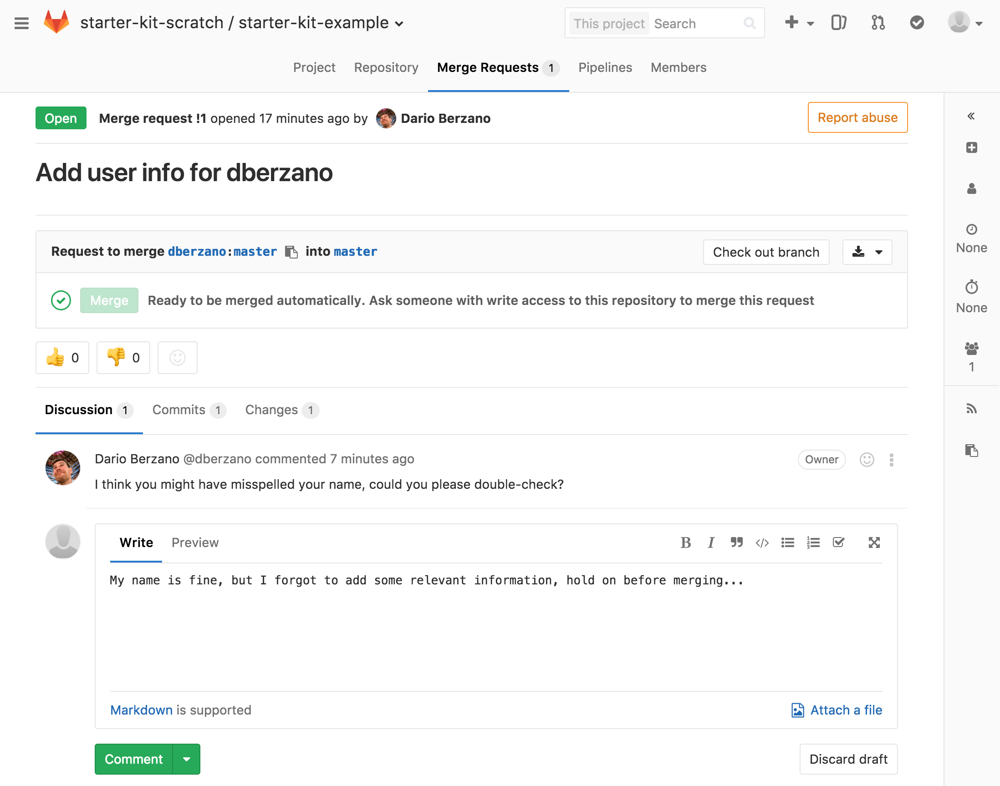
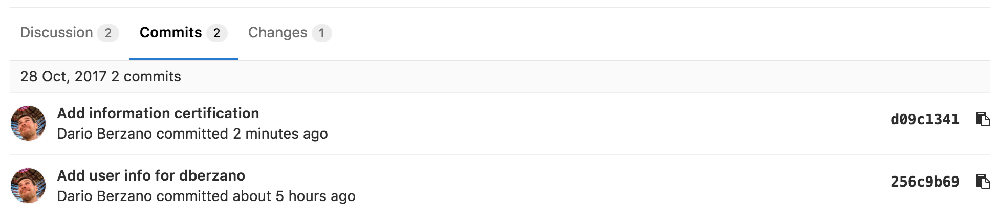
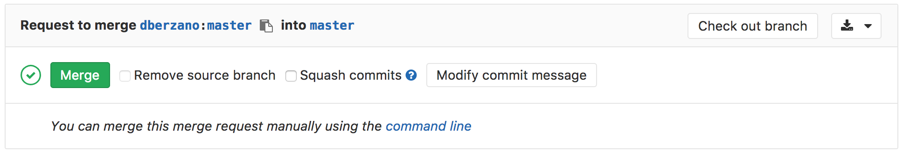

# Collaborating with Pull Requests



* Collaborate to Git repositories by proposing changes
* Understand what a Pull (or Merge) Request is
* Use GitLab discussion and review tools to converge on a proposed change



In this lesson we are going to learn how the distributed nature of Git comes in
handy when working on larger projects. We will also see how this approach turns
out to be useful even when working on small projects with only three or four
contributors.

The most naive approach to Git collaboration is what we have [previously
seen](08-share.md):

* We have a **single remote repository**
* This repository has one or more **owners** who decide who can contribute
* **Contributors** can push their changes directly on the repository

[GitHub](https://github.com) has introduced the concept of **Pull Requests**,
which has been subsequently adopted by its most famous clone,
[GitLab](https://gitlab.com).


## What is a Pull (or Merge) Request

Pull Requests are a way to **propose changes** to a remote repository without
having write permissions to it, and therefore without pushing to it directly.
Note that GitLab (which we are going to use for the following examples) uses the
term "Merge Requests" but the concept stays the same.

The general idea behind Pull Requests is:

* I would like to **collaborate** to a repository by adding some code
* I **push** this code *somewhere*
* I submit this code for a review to the owners of the original project (this is
  where I open a **Pull Request**)
* Owners will decide whether to **accept or reject** my changes, and a Web-based
  interface allows people to **comment and discuss**



We have seen in a [previous lesson](07-gitlab.md) that the act of
incorporating remote changes into a repository is called "pulling" and it is
achieved by variations of the command `git pull`.

Projects using Pull Requests do not allow people to `git push` code to them.
Instead, what you are doing is **requesting them to pull your code** instead,
therefore the name.





The concept of Pull Requests leverages certain features of Git, but it's not
part of the `git` tool itself: it depends on the hosting platform you use.




## Fork the original project repository

The first step when collaborating to a project is to create a **fork**
of the remote repository. Let's see exactly what it means with an example.

Connect to our example repository using a Web browser:

> https://gitlab.cern.ch/starter-kit-scratch/starter-kit-example

and click on the "Fork" button:



If you have played already with GitLab groups you might have several fork
destinations, if so, just select your user:



Your GitLab account will now contain a repository with the same name as the
original, `starter-kit-example`.

At this point, CERN GitLab contains several copies of the same repositories:
the main one, and all the forks you have just created. Those copies are **remote
clones** for now, as they are not on your laptop yet.

The main feature of your fork is that you (and by default you only) have **write
permissions** to it. You cannot directly push to the original repository, but
you can write to your fork.



When you create a fork, you make a snapshot of the original repository at a
given moment in time. From that point on, the fork is independent from both the
original repository and any forks made by other users.




## Clone a remote project and its fork

Now it is time to open your terminal and clone the remote project. [As we have
already seen](07-gitlab.md) we can use the SSH URL for cloning the project:

```bash
$ mkdir test_merge_requests/
$ cd test_merge_requests/
$ git clone ssh://git@gitlab.cern.ch:7999/starter-kit-scratch/starter-kit-example.git
```
```
Cloning into 'starter-kit-example'...
remote: Counting objects: 3, done.
remote: Compressing objects: 100% (2/2), done.
remote: Total 3 (delta 0), reused 0 (delta 0)
Receiving objects: 100% (3/3), done.
```

Now putting into practice [what we have already learnt](07-gitlab.md) let's add
our fork as a remote, it will have the same URL as the main repository except
`starter-kit-scratch` is replaced with your CERN username:

```bash
cd starter-kit-example/
git remote add YOUR_CERN_USERNAME ssh://git@gitlab.cern.ch:7999/YOUR_CERN_USERNAME/starter-kit-example.git
```



* How many remotes do you have now in your repository?
* What are their names?



You can verify what are your remotes by using the `git remote` command:

```bash
$ git remote -v
```
```
dberzano	ssh://git@gitlab.cern.ch:7999/dberzano/starter-kit-example.git (fetch)
dberzano	ssh://git@gitlab.cern.ch:7999/dberzano/starter-kit-example.git (push)
origin	ssh://git@gitlab.cern.ch:7999/starter-kit-scratch/starter-kit-example.git (fetch)
origin	ssh://git@gitlab.cern.ch:7999/starter-kit-scratch/starter-kit-example.git (push)
```

You now have **two remotes**: the default one, corresponding to the upstream
repository, is called `origin` and you have added it when you have cloned the
repository. The second one is named after your CERN account and you have created
it explicitly with `git remote add`.






## Sync your local repository with remote changes

You are now ready to start working on your new feature on your laptop. First off
since you are using different remotes, make sure your local Git working
directory is up-to-date with the upstream (_i.e._ the "main", or `origin`)
repository.

If you don't have any pending local change, you can do:

```bash
$ git pull
```

Since your current branch "tracks" by default the corresponding remote branch
on the main (`origin`) repository, the `git pull` command will by default do the
right thing. This is equivalent of explicitly telling `git` to fetch changes
from `origin`:

```bash
$ git pull origin
```



In some cases you might end up with your working directory (and/or branch)
"messed up" and the `git pull` command will not work seamlessly. If you are sure
you are not going to lose anything important, you can simply reset your current
working directory by **ignoring any local modification and destroying it**:

```bash
$ git fetch --all  # make local git aware of what changed remotely
$ git reset --hard origin/master  # lose any local modification
$ git clean -fxd  # get rid of any extra files not under version control
```

You should be **very careful** about using the `git reset` and `git clean`
commands, but they are very useful when your working area got messed up somehow.




## Implement your new feature

You can now implement your new "feature" by adding a bunch of files with some
random content to your local repository. As an exercise, you can try to add a
file named after your CERN username:

```bash
echo "My name is Firstname Lastname" > YOUR_CERN_USERNAME.txt
```

Replace `YOUR_CERN_USERNAME` with your CERN username to avoid [conflicts](10-conflict.md).

You can now commit the changes:

```bash
$ git add --all -v
$ git commit -m 'Add user info for YOUR_CERN_USERNAME'
```



* What did you do with `git add`?
* What did you do with `git commit`?
* Why is the commit message appropriate?
* Where are my changes now?



`git add --all` adds all untracked/modified files to the "staging area", that
is: the area containing the files which will be part of the next commit. The
`-v` (as in *verbose*) switch is useful to spot unwanted additions, as it
prints out every added file.

`git commit` creates a commit, whose message is appropriate as it is shorter than
50 characters and meaningful, in other words it's *concise*.

Your commit is only **on your laptop only** and it is not yet available in your
fork, or on the upstream repository.






## Push changes

Without further ado let's push:

```bash
$ git push
```

Unfortunately it does not work (your message might actually be different):

```
Counting objects: 3, done.
Delta compression using up to 8 threads.
Compressing objects: 100% (2/2), done.
Writing objects: 100% (3/3), 316 bytes | 316.00 KiB/s, done.
Total 3 (delta 0), reused 0 (delta 0)
remote: GitLab: You are not allowed to push code to protected branches on this project.
To ssh://gitlab.cern.ch:7999/starter-kit-scratch/starter-kit-example.git
 ! [remote rejected] master -> master (pre-receive hook declined)
error: failed to push some refs to 'ssh://git@gitlab.cern.ch:7999/starter-kit-scratch/starter-kit-example.git'
```

By default, `git push` attempts to push to `origin`, which is forbidden in this
case! All modifications must go through Pull Requests. This means the only way
we have is to push our changes to our own fork:

```bash
$ git push YOUR_CERN_USERNAME
```

This time we have had more luck:

```
Counting objects: 3, done.
Delta compression using up to 8 threads.
Compressing objects: 100% (2/2), done.
Writing objects: 100% (3/3), 316 bytes | 316.00 KiB/s, done.
Total 3 (delta 0), reused 0 (delta 0)
To ssh://gitlab.cern.ch:7999/dberzano/starter-kit-example.git
   764051d..256c9b6  master -> master
```

OK, so your changes are now pushed to your private repository. Before opening
the Pull Request let's check the status of the remote repositories.



How do you use `git log` to see exactly what the two remote repositories
(`origin`, and your fork) contain?



We use the `--decorate` option to show local and remote branches and tags (`-10`
is to limit the history to 10 commits):

```bash
$ git log -10 --oneline --graph --decorate
```

This is the output (most recent commits are on top):

```
* 256c9b6 (HEAD -> master, dberzano/master) Add user info for dberzano
* 764051d (origin/master, origin/HEAD) Add initial README
```

So you will see that:

* the main repository (`origin/master`) is *behind* yours
* your local repository (`master`) and your remote fork (`dberzano/master`) are
  in sync and contain the commit you've just authored






## Create a Pull (or Merge) Request

As we have said before, Pull Requests are not part of Git but they depend on
the provider hosting your Git repositories. On GitLab you need to point your
Web browser to your repository:

> https://gitlab.cern.ch/YOUR_CERN_USERNAME/starter-kit-example

Then click on the **+ (plus)** button and select **New merge request**:



On the next screen, select `master` as **Source branch**:


then click the green **Compare branches and continue** button. The next screen
allows you to review the changes graphically (you need to go at the bottom of
the page and click the **Changes** tab):



If the changes look good to you, assign a title to your Merge Request, and an
extended description. You should follow the same policies you use for writing
commit messages:

* keep the **Title** below 50 characters (well, you don't need to count, but do
  your best to keep it short!),
* add any extra information in the **Description** field.



If your Pull Request has only one commit, the **Title** and **Description**
fields will be automatically filled for you.





When you are ready to proceed, click on the big green **Submit merge request**
button.

Now, sit back and relax!


## Discussing, amending, retiring a Merge Request

Once a Merge Request is opened the repository owners are notified (usually via
email), and they (or even somebody else, depending on the repository's
permissions) can add comments and requests before accepting your changes.

Merge Requests are each given a sequential number. The first ever merge request
on the example respository can be found at:

> https://gitlab.cern.ch/starter-kit-scratch/starter-kit-example/merge_requests/1

This is how a comment appears, and how you can reply to it:



When you are ready just click on the **Comment** button.

In our example, we have realized that we wanted to add something more to the
Merge Request before proceeding. Doing so is as simple as authoring and pushing
more commits.

Let's go back to our local working directory, edit the file
`YOUR_CERN_USERNAME.txt` and add a line to it:

```bash
$ echo "I hereby certify that this information is true." >> YOUR_CERN_USERNAME.txt
```

Now commit:

```bash
$ git commit -a -m 'Add information certification'
```
```
[master d09c134] Add information certification
 1 file changed, 1 insertion(+)
```

...and finally push (once again, remember to do it to your remote):

```bash
$ git push YOUR_CERN_USERNAME
```
```
Counting objects: 3, done.
Delta compression using up to 8 threads.
Compressing objects: 100% (3/3), done.
Writing objects: 100% (3/3), 359 bytes | 359.00 KiB/s, done.
Total 3 (delta 0), reused 0 (delta 0)
To ssh://gitlab.cern.ch:7999/dberzano/starter-kit-example.git
   256c9b6..d09c134  master -> master
```

Voilà, it's done: you have just added more commits to your Merge Request! Let's
look on the Web at the commits you have added. Go to the Merge Request page
and click on the **Commits** tab at the bottom, here is a direct link for the example:

> https://gitlab.cern.ch/starter-kit-scratch/starter-kit-example/merge_requests/1/commits





Opening a Merge/Pull Request does not mean creating a static snapshot of your
working area at the time when you have opened it; instead, your working area
(*i.e.* your *branch* on your *remote*, note that we are only using one branch
called `master`, which is the default, for simplicity) is dynamically linked to
the Merge Request. The link disappears the moment the Merge Request is closed,
or accepted.



Adding commits to an existing Merge Request is the very essence of using Merge
Requests: you submit your content for scrutiny, and reviewers will say what
they think before accepting it, giving you the ability to amend things as you
go.

If you or the maintainers of the project are not happy with a Pull Request it
can be retired by clicking on the orange **Close merge request** button on top
of the page:


## Accepting a Pull Request

When a Merge Request looks good, the repository owners will click on the
**Merge** button:



Your code is then finally included upstream. On your local repository, if you
want to work on a new feature, you can simply start over by [fetching remote
changes first as explained earlier](#sync-your-local-repository-with-remote-changes).


## The social side of coding

Using Pull Requests can seem overly complicated at first, but they are a very
efficient way to truly collaborate on large projects.

* **A Pull Request represents an atomic unit of work.** You can open a Pull
  Request for adding a certain feature, composed by several commits with work in
  progresses, minor fixes, major bug fixes. When merged, the feature is finally
  there and complete, available to every collaborator. You reduce the chance of
  having incomplete and/or buggy features in released versions of the code.
* **When writing a Pull Request, you know that your code will be viewed by
  someone.** This makes you more attentive to what other persons will think
  when they see it, making you a better collaborator.
* **Sometimes, good code is like wine (it has to age a little bit to taste
  better).** Pull Requests might stay open for a while before being accepted,
  do not be in a rush: having your code reviewed (sometimes by the most annoying
  and pickiest reviewer!) is a chance for improvement.



Some Pull Requests on large projects can get rather controversial. Bear in mind
that Pull Requests are about facilitating collaboration for a common goal, and -
as in real life - try not to go on a rampage, at least not too quickly!




## Automatic testing

Merge requests can be configured to prevent changes from being merged into the
main branch of a repository if any of the project's builds or tests fail to run
correctly. This is useful to try and ensure that the `master` branch always
contains a "good" version of the project. See the [continuous integration](11-ci.md)
lesson for details on how to set this up with GitLab, along with a list of
services that can be used with other git hosts.




* "Forking" means to create your private editable copy of a remote project on
  the servers
* "Cloning" means to download locally a remote repository and/or its fork
* "Pull/Merge Requests" allow for discussing code and content before including
  it
* Automatic testing on Pull/Merge Requests ensures better upstream code quality




[CC BY 4.0](https://creativecommons.org/licenses/by/4.0/legalcode) - Original
content 

