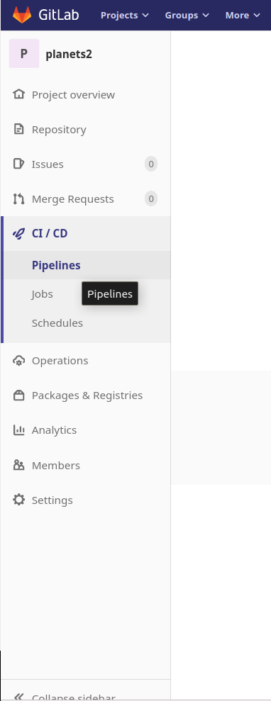
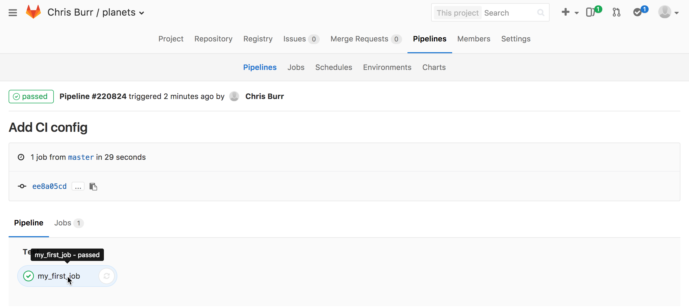
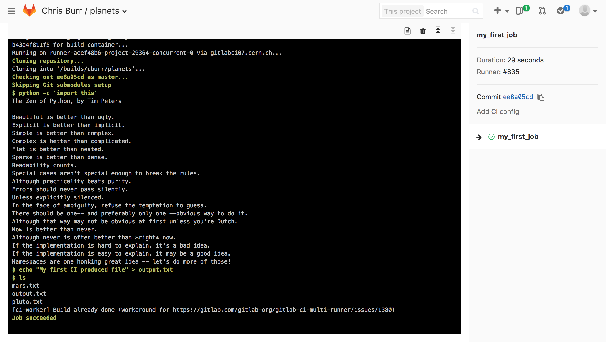
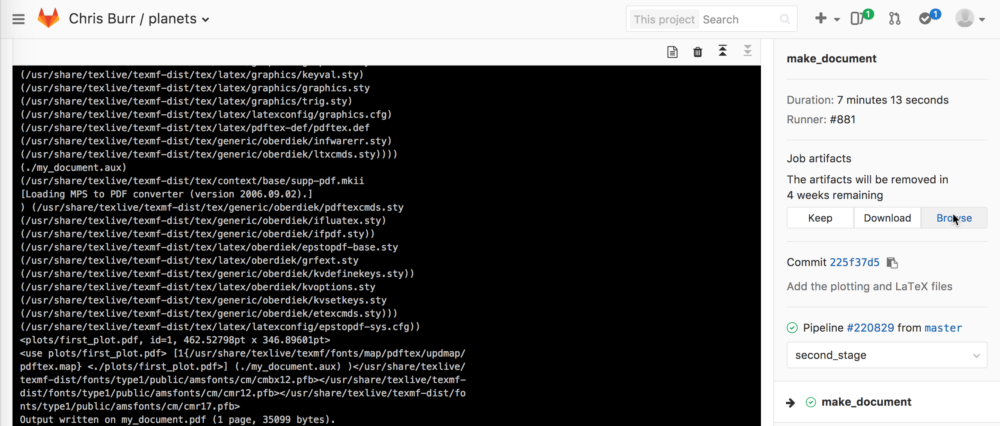

# GitLab CI



- Understand what continuous integration is and why it is useful.
- Be able to set up a simple CI pipeline.
- Store an artefact from a CI job.



Continuous integration (or CI) is a popular development practice where one or
more tasks are ran automatically, often each time a commit is pushed to a remote
repository. These tasks typically involve running tests for software packages or
deploying changes. In fact, this very website is tested and automatically
updated using CI jobs. In addition to the conventional uses, some physicists use
this to automatically build LaTeX documents or parts of their analyses.

Some examples of CI services are [Travis CI](https://travis-ci.org/),
[CircleCi](https://circleci.com/), [AppVeyor](https://www.appveyor.com/) and
[GitLab CI](https://about.gitlab.com/product/continuous-integration/). In this lesson we
will use GitLab CI and it is integrated into CERN's GitLab instance that allows
continuous integration to be used for free for both private and public git
repositories without the need to sign up to additional services.

In order to start using GitLab CI you just need to commit a file in the main
directory of your repository called `.gitlab-ci.yml`. This file is used to
specify a pipeline, which can be built up of any number of interconnected stages
with each job having it's own environment. A minimal example of this file is:

```yaml
my_first_job:
    image: gitlab-registry.cern.ch/ci-tools/ci-worker:cc7
    script:
        - python -c 'import this'
        - echo "My first CI produced file" > output.txt
        - ls
```

This creates a single job named `my_first_job` and the `image:` key defines a
[docker image](https://www.freecodecamp.org/news/a-beginner-friendly-introduction-to-containers-vms-and-docker-79a9e3e119b/)
which is used the define the environment that is used to run the job. In this case we use an
[official CERN CentOS 7 image](https://gitlab.cern.ch/ci-tools/ci-worker/container_registry).
The `script:` key then defines one or more commands which are executed
sequentially. If any of the command return a non-zero exit code the execution
stops and the "build" is marked as failed.

Once this file is committed and pushed you can go to the GitLab web interface
for your planets repository and click on the tab for "Pipelines" within the CI/CD tab on the left sidebar.



Here you can see any recent pipelines, at first our pipeline is marked as
pending while it waits for a suitable machine, known in GitLab CI as a runner,
to be available. CERN provides a collection of shared runners which are
available to all users and these are automatically enabled for all repositories.

Typically a trivial job like this one will take a few minutes to run, which is
almost entirely spent setting up the environment prior to starting the actual
job. Once your job is completed you should be able to see the output of the job
by clicking on the status of the pipeline:


Followed by name of the job you are interested in:



If you scroll down the page you should then be able to see the output of the
three commands:





If you ever want to check on a job's progress the log file can also be examined
while a job is running using the same method.



Sometimes it is useful to be able to store files that are produced during a
pipeline, such as the `output.txt` file we have produced. Currently the file is
automatically deleted when the job ends, however, the output files and
directories can be automatically kept for up to 30 days using by defining them
as an "artefact". Additionally artefacts can be used in later stages in a
pipeline by being marked as a dependency.

Our first pipeline can be extended to produced a plot using python and then
compile a LaTeX document using this plot by modify `.gitlab-ci.yml` to contain:

```yaml
stages:
    - first_stage
    - second_stage

my_first_job:
    stage: first_stage
    image: gitlab-registry.cern.ch/ci-tools/ci-worker:cc7
    script:
        - python -c 'import this'
        - echo "My first CI produced file" > output.txt
        - ls
    artifacts:
        paths:
            - "*.txt"

make_plot:
    stage: first_stage
    image: continuumio/anaconda3:latest
    before_script:
        # Matplotlib should use a backend that is suitable for CI
        - 'echo "backend : Agg" > matplotlibrc'
    script:
        - mkdir -p plots/
        - python make_plot.py
    artifacts:
        paths:
            - plots/

make_document:
    stage: second_stage
    image: gitlab-registry.cern.ch/ci-tools/ci-worker:cc7
    before_script:
        - yum install -y texlive ghostscript latexmk
    script:
        - latexmk -pdf my_document.tex
    dependencies:
        - make_plot
    artifacts:
        paths:
            - my_document.pdf
```

Each keyword in the configuration does the following:

 - **stages**: Used to specify the order in which to run each stage. Each job is
   then assigned to a particular stage using the **stage** key. All jobs in a
   stage can be executed in parallel, while later jobs will wait until all jobs
   in the previous stage have completed successfully.
 - **image**: Defines a docker image which is used to provide the environment
   (i.e. what software is installed) for the job.
 - **before_script**: One or more commands which are executed before starting
   the main job. This is typically used for installing software and generally
   setting up the environment.
 - **script**: One or more commands to be executed.
 - **artifacts**: Used to store files and directories produced by the job.
 - **dependencies**: Used to specify previous jobs which create artefacts that
   are required by this job. These are then placed into the job's environment at
   the same path that they were originally created at.

See the [GitLab CI documentation](https://docs.gitlab.com/ee/ci/yaml/) for a
full description of the CI configuration file.

Again commit and push the `.gitlab-ci.yml` file along with
[`make_plot.py`](files/make_plot.py) and [`my_document.tex`](files/my_document.tex)
and wait for the pipeline to complete. In the sidebar on the right you are then
be able to download some or all of the build artefacts like so:





Sometimes it can be difficult to understand errors in the configuration of a
pipeline. Fortunately there is [a helpful page](https://gitlab.cern.ch/ci/lint)
which can be used to find errors or see how the configuration is interpreted
without needing to make a commit.





To see the full documentation for what can be included in the CI configuration
see the official [GitLab CI documentation](https://docs.gitlab.com/ee/ci/yaml/).





Some of the shared runners at CERN have special features available such as
CVMFS. Additionally, you can make a private runner if you want to completely
control the runner and add features such a persistent storage between builds.
See the [CERN documentation](https://cern.service-now.com/service-portal/article.do?n=KB0003690)
for more details and examples for common use cases.





- Continuous integration can be used to run commands or scripts every time a
  commit is pushed.
- The `.gitlab-ci.yml` file is used to configure CI.


