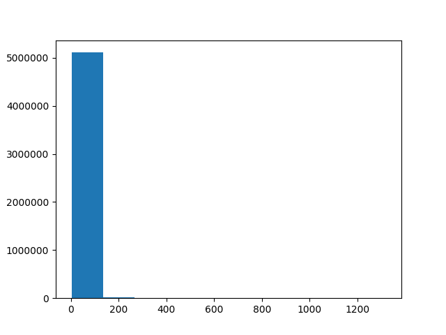
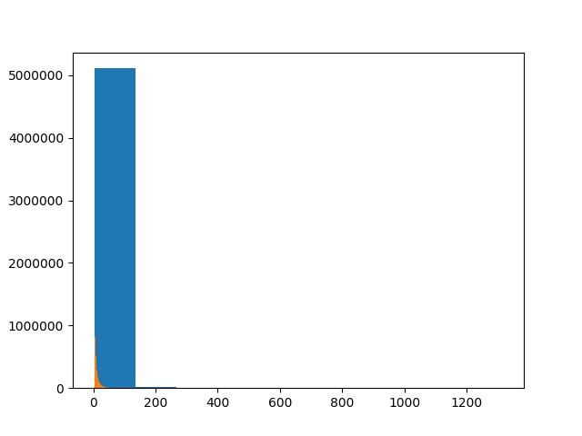
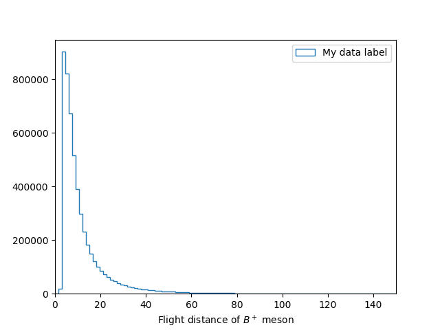
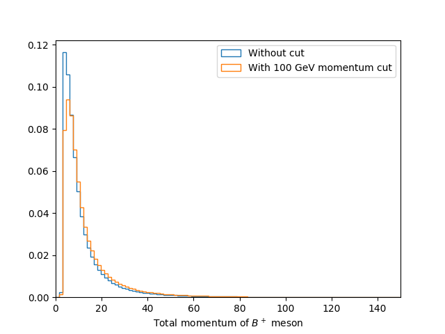

# Making your first histogram

In this section we are going to make our first plots using Python. For this we
will use some public LHCb data for `$ B^+ \rightarrow H^+ H^+ H^-  $` from the
[CERN open data portal](http://opendata.cern.ch/?ln=en). This data is available
on EOS:

```bash
$ eos root://eospublic.cern.ch/ ls /eos/opendata/lhcb/AntimatterMatters2017/data
B2HHH_MagnetDown.root
B2HHH_MagnetUp.root
PhaseSpaceSimulation.root
```




It is however usually preferable and safer to do everything inside a virtual environement.
The latter is like a copy of your current environement. Thus you can modify your virtual 
environement (including installing/deleting/updating modules) without affecting your default
environement. If at some point you realize you have broken everything, you can always exit
the virtual environement and go back to the default lxplus one.

To build a virtual environement based on LCG views, you can use [LCG_virtualenv][lcg_virtualenv]:

```bash
git clone https://gitlab.cern.ch/cburr/lcg_virtualenv.git
./lcg_virtualenv/create_lcg_virtualenv myVenv
```
To activate the virtual environement do:

```bash
source myVenv/bin/activate
```

You can then install stuff with `pip`. In this lesson we will be using
[`root_pandas`](https://github.com/scikit-hep/root_pandas), which can
be installed using:

```bash
pip install --upgrade root_pandas matplotlib
python -c 'import pandas; print(f"Got pandas from {pandas.__file__}")'
python -c 'import root_pandas; print(f"Got root_pandas from {root_pandas.__file__}")'
python -c 'import matplotlib; print(f"Got matplotlib from {matplotlib.__file__}")'
```

You can go back to the default environement using the `deactivate` command.





Even if not recommended, you can also install modules directly, without using a virtual environment.
While LCG provides a lot of useful packages, there are sometimes things missing.
Fortunately, most packages can be easily installed into `~/.local/` using `pip`
with the `--user` flag. In this lesson we will be using
[`root_pandas`](https://github.com/scikit-hep/root_pandas), which can
be installed using

```bash
pip install --user root_pandas
```

Some packages, such as [flake8](http://flake8.pycqa.org/), provide executables
which are useful to have included on your `PATH` so they are available without
specifying their absolute path. This can be done by running
```bash
export PATH=$(python -m site --user-base)/bin:$PATH
```
see the bash lesson for more details about the `PATH` variable.

We can even upgrade already installed packages using:
```bash
pip install --user matplotlib --upgrade
```

As LCG uses `PYTHONPATH` to make packages available, any packages it provides
have higher priority than the user installed packages. In order to make it so
that a package installed with `--user` takes precedence, you must run
```bash
export PYTHONPATH=$(python -m site --user-site):$PYTHONPATH
```
every time you run the `source` command above. This is **only** needed when
installing user packages to upgrade LCG provided ones.




All ROOT methods made available in Python using a set of automatically generated
bindings, known as [PyROOT](https://root.cern.ch/pyroot).
These are all available by using `import ROOT`.
For example if we want to create a `TFile` using the aforementioned data we can
launch `ipython` and run:

```python
In [1]: import ROOT
In [2]: filename = 'root://eospublic.cern.ch//eos/opendata/lhcb/AntimatterMatters2017/data/B2HHH_MagnetDown.root'
In [3]: my_file = ROOT.TFile.Open(filename)
In [4]: my_file.ls()
```
```
TNetXNGFile**       root://eospublic.cern.ch//eos/opendata/lhcb/AntimatterMatters2017/data/B2HHH_MagnetDown.root
 TNetXNGFile*       root://eospublic.cern.ch//eos/opendata/lhcb/AntimatterMatters2017/data/B2HHH_MagnetDown.root
  KEY: TTree    DecayTree;1 Tree continaing data for B- --> h-h+h- decays
In [5]: my_tree = my_file.Get('DecayTree')
In [6]: my_tree.Print()
******************************************************************************
*Tree    :DecayTree : Tree continaing data for B- --> h-h+h- decays          *
*Entries :  5135823 : Total =       945201357 bytes  File  Size =  666480138 *
*        :          : Tree compression factor =   1.42                       *
******************************************************************************
```

While it is very useful to be able to access all the ROOT functionality in this
way, they are often slow and tedious to use. Luckily people have built more
specialised bindings to allow ROOT to be used in a more pythonic way.

## Pandas

[`pandas`](https://pandas.pydata.org/) is a library for doing data analysis on
tabular data, using a data structure known as dataframes. These typically have
columns with labels (like `TLeaf`s in a `TTree`) with many rows. The
`root_pandas` package we installed earlier can be used to create a pandas
`DataFrame` from a root file:

```python
In [7]: import root_pandas
In [8]: df = root_pandas.read_root(filename, key='DecayTree')
```

We can then use `df.head(5)` to see the first 5 rows of the `DataFrame`:

```python
In [9]: df.head(5)
Out[9]:
   B_FlightDistance  B_VertexChi2        H1_PX        H1_PY          H1_PZ  \
0         25.301004      1.497280   375.284205   831.308481   51820.233718
1         94.690700      1.383338 -4985.130785  5853.750057  326157.454706
2          8.284490      5.187101 -1265.456544  2330.050788   90762.658032
3          5.590769      7.129099  -720.797259  3413.790588   86793.058768
4          3.013242     10.988701   397.754571  1791.373059   40040.364159
```

While it is nice to be able to view the data, it is typically much more useful to
be able to apply operations to it in bulk. In this example we have the momentum
components for each of the child particles in the decay (`H1`, `H2` and `H3`)
but not the transverse momentum. We can however apply expressions to each row
of the data like so:

```python
In [10]: df.eval('sqrt(H2_PX**2 + H2_PY**2)')
Out [10]: 0          1306.642724
1           167.578904
2          1273.457019
3          1146.299204
             ...
5135820     210.430531
5135821     762.344570
5135822    1454.471057
dtype: float64
```

This gives us the transverse momentum for each particle as an array, however, we
can also create a new column with this information by assigning to the name we
want to create and doing the action "inplace":

```python
In [11]: df.eval('H2_PT = sqrt(H2_PX**2 + H2_PY**2)', inplace=True)
```




Create a new column in the dataframe called `B_P` for the total momentum of the
B+ meson.



```python
df.eval('B_P = sqrt('
        '(H1_PX + H2_PX + H3_PX)**2 + '
        '(H1_PY + H2_PY + H3_PY)**2 + '
        '(H1_PZ + H2_PZ + H3_PZ)**2'
        ')', inplace=True)
```





## Plotting histograms

Now that we have the momentum of the `$ B+ $` meson, it would be useful to plot
its distribution in a histogram. We could use ROOT for this but the most popular Python library for
plotting is known as [`matplotlib`](https://matplotlib.org/) and this is what we
will use here. The most common way `matplotlib` is used is with the `pyplot`
interface imported as `plt` like so:

```python
In [12]: import matplotlib
In [13]: matplotlib.use('Agg')  # Force matplotlib to not use any Xwindows backend.
In [14]: from matplotlib import pyplot as plt
In [15]: plt.hist(df['B_FlightDistance'])
In [16]: plt.savefig('B_flight_distance.pdf')
```





There are various ways of viewing plots interactively such as:

 - `plt.show()` Opens a window with the current plot and pauses the Python
   interpreter until the window is closed
 - `plt.ion()` Allows plots to be viewed without pausing the Python interpreter
 - [`jupyter`](https://jupyter.org/) A web based interface for running various
   languages including python in "notebooks". If you've used `mathematica` or
   `matlab` before it's a similar interface with code, documentation and plots
   all shown together.



```python
In [17]: import numpy as np
In [18]: bins = np.linspace(0, 150, 100)
In [19]: plt.hist(df['B_FlightDistance'], bins=bins)
In [20]: plt.savefig('B_flight_distance_v2.pdf')
```



That's not right! The new histogram has been plotted on top of our first one!

This is normally useful as it allows us to layer plots on top of each other to
compare them. Though in this case we don't want to do that so we should first close
the previous plot before making our histogram. We should also add axis labels
and a legend like so:

```python
In [21]: plt.close()  # Close the previous plot

In [22]: plt.hist(df['B_FlightDistance'], bins=bins, histtype='step', label='My data label')
In [23]: plt.xlim(bins[0], bins[-1])
In [24]: plt.xlabel('Flight distance of $B^+$ meson')
In [25]: plt.legend(loc='best')
In [26]: plt.savefig('B_flight_distance_v3.pdf')
```



## Applying cuts

When analysing data it is often useful to "throw away" some data in order to in
order change the contributions of a sample. Most commonly this is to remove some
background(s) so we can more precisely study a process of interest. This is
known as cutting.

In pandas we can apply a cut to a DataFrame using the `query` method. For
example to make a new DataFrame containing `$ B^+ $` mesons with flight distances
of more than 15 mm we can use:

```python
In [27]: df_with_cut = df.query('B_FlightDistance > 15')
```




It is often useful to compare the effect of a cut on the distribution of another
variable. Try to plot a histogram showing the B+ lifetime distribution with and
without a total B+ momentum cut of 100000 MeV.



```python
bins = np.linspace(0, 150, 100)
df_with_cut = df.query('B_P > 100000')

plt.figure()
plt.hist(df['B_FlightDistance'], bins=bins, histtype='step', density=1, label='Without cut')
plt.hist(df_with_cut['B_FlightDistance'], bins=bins, histtype='step', density=1, label='With 100 GeV momentum cut')

plt.xlim(bins[0], bins[-1])
plt.xlabel('Total momentum of $B^+$ meson')
plt.legend(loc='best')
plt.savefig('B_flight_distance_with_cut_compare.pdf')
```

Here we also use the `normed=True` option with `plt.hist`, this plots the
normalised distribution. This is typically more useful when comparing
distributions as it make it easier to see differences in the shape without the
independently of the total number of events.









Calculate and plot the B+ meson mass assuming that all three of the child
hadrons are kaons.


