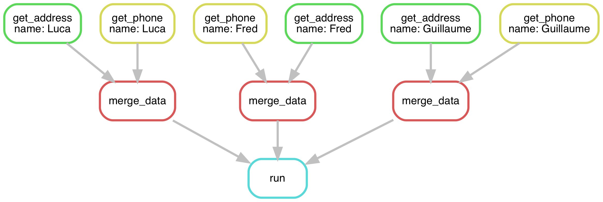

# Analysis automation with Snakemake



- Learn what analysis automation is and how it helps with analysis preservation
- Learn how to create a pipeline with Snakemake



## Documentation and environments

You can find full documentation for Snakemake
[here](https://snakemake.readthedocs.io/en/stable/index.html);
you can also ask any questions you have on the
[~reproducible](https://mattermost.web.cern.ch/lhcb/channels/reproducible)
channel on mattermost.
Web searches and [Stack Overflow](https://stackoverflow.com/questions/tagged/snakemake)
are also your friends.



Snakemake is best-run at LHCb using the `lb-conda` environment.
This environment comes with very recent versions of
ROOT, python, cmake, g++, snakemake, *etc.*, ready to use.
In general, it is recommended that if you are running non-lhcb software
(*e.g.*, code you've written yourself for your analysis)
it should be done with `lb-conda`.
More information on using `lb-conda` can be found [here](https://gitlab.cern.ch/lhcb-core/lbcondawrappers/-/blob/master/README.md).

To have access to `lb-conda` you must first have sourced `LbEnv`.
This is done by default on lxplus;
otherwise, it is done with `source /cvmfs/lhcb.cern.ch/lib/LbEnv`
(assuming [`cvmfs`](https://cvmfs.readthedocs.io/en/stable/) is installed).

The default environment can be entered with the command `lb-conda default`,
where `default` is the name of the environment.
This will enter you into an interactive bash shell.

> The full list of available environments can be found by running `lb-conda --list`.

You can optionally pass a command after the environment name,
*e.g.*, `lb-conda default foo`,
which will run the `foo` command in the environment and then exit.
(This is similar to the behaviour of [`lb-run`](https://twiki.cern.ch/twiki/bin/view/LHCb/SoftwareEnvTools).)

If you want, you can include your `.bashrc` file in the created environment
by running `lb-conda default bash -c 'bash --rcfile ~/.bashrc'`.
Be careful if you do this--it can lead to conflicts in the environment.



You can check if Snakemake is working by calling `snakemake --help`
in the `lb-conda default` environment.

## Workflow preservation

There is an ongoing effort at LHCb to ensure analysis workflows are preserved.
You can learn more about this effort and how Snakemake figures into it
[here](https://lhcb-dpa.web.cern.ch/lhcb-dpa/wp6/workflow-preservation.html).

## Basic Tutorial

### What is a workflow?

When performing an analysis, you typically start with some set of input files
containing the data you are interested in
and want to end up with some set of output files containing the results of your
measurements.
A workflow is what gets you from the input to the output.

Let us consider a simple example.
Create a new directory to work in and generate some fake input files:
```bash
mkdir basic_tutorial
cd basic_tutorial
mkdir input
touch input/{a..z}.in
ls input/
```
You should see a list of empty files named `a.in`, `b.in`, ..., and `z.in`.



Add the text `My name is a.` to the end of `input/a.in`
and save it as `output/a.out` without modifying `input/a.in`.
Do this for each file in `input/`.



You could open each file, type the appropriate text
(*e.g.*, `My name is a.`, `My name is b.`, *etc.*),
and save it as the appropriate output file,
but since this is such a simple workflow,
we can easily make the shell do it for us:

```bash
mkdir -p output  # make the directory if needed
for file in input/*.in; do
  noext="${file%.in}"  # drop the extension
  name="${noext##input/}"  # drop the directory
  ofile="output/${name}.out"  # declare output file name
  cat "$file" > "$ofile"  # create output file with contents of input file
  echo "My name is $name." >> "$ofile"  # append the required text
done
```





Congratulations, you've just defined and executed a workflow!

### Why use a workflow management system?

> “The Snakemake workflow management system is a tool
> to create reproducible and scalable data analyses”

The example workflow above is very simple,
but you can probably imagine more complicated ones.
Suppose you wanted to adjust your input files in more complicated ways,
had multiple types of input or output files,
or wanted to do calculations that didn't depend on just one input file.
Or suppose that your calculations took a long time
and you only wanted to re-run them if the inputs had changed.
These are all reasons to use a workflow management system.

- A workflow management system allows you to:
  - Keep a record of how your scripts are used
    and what their input dependencies are
  - Run multiple steps in sequence, parallelising where possible
  - Automatically detect if something changes and then reprocess data if needed
- Using a workflow management system forces you to:
  - Keep your code and your locations in order
  - Structure your code so that it is user-independent
  - Standardise your scripts
    - Bonus: Standardised scripts can sometimes be used across analyses!

If you have ever performed an HEP analysis
or looked at the code for someone else's analysis,
you probably understand why the above features are so useful.

### Introducing Snakemake

Snakemake allows you to create a set of rules,
each one defining a step of your analysis.
The rules need to be written in a file called `Snakefile`.
For each rule you need to provide:

- The *input*: Data files, scripts, executables or any other files.
- The expected *output*. It's not required to list all possible outputs.
  Just those that you want to monitor
  or that are used by a subsequent step as inputs.
- A *command* to run to process the input and create the output.

The basic rule is:
```python
rule myname:
    input: "myinput1", "myinput2"
    output: "myoutput"
    shell: "Some command to go from in to out"
```

Let's give it a try with our simple example above.
In the same `basic_tutorial` directory,
let us first remove all our hard work by running
```bash
rm -rf output/
```
Now, we create our `Snakefile`.
In your favorite text editor,
open a new file called `Snakefile` and type
```python
rule name_files:
    input: "input/a.in"
    output: "output/a.out"
    shell: "cat input/a.in > output/a.out && echo 'My name is a.' >> output/a.out"
```
Snakemake now knows how to create `output/a.out`.

You can run it by calling
```bash
snakemake output/a.out --cores 1
```
This tells Snakemake that you want to generate `output/a.out` if needed
and to use only one computing core to do so.
When you run it,
you should see something like:
```text
Building DAG of jobs...
Using shell: /cvmfs/lhcbdev.cern.ch/conda/envs/default/2021-09-07_04-06/linux-64/bin/bash
Provided cores: 1 (use --cores to define parallelism)
Rules claiming more threads will be scaled down.
Job stats:
job           count    min threads    max threads
----------  -------  -------------  -------------
name_files        1              1              1
total             1              1              1

Select jobs to execute...

[Mon Nov 15 18:30:25 2021]
rule name_files:
    input: input/a.in
    output: output/a.out
    jobid: 0
    resources: tmpdir=/tmp/username

[Mon Nov 15 18:30:26 2021]
Finished job 0.
1 of 1 steps (100%) done
Complete log: /afs/cern.ch/user/u/username/basic_tutorial/.snakemake/log/2021-11-15T183022.449488.snakemake.log
```
Here, we see that Snakemake selected the rule `name_files` to create `output/a.out`.
Calling `cat output/a.out`,
we see that the expected file was created with the appropriate text.
Notice that we did not have to tell Snakemake to create the `output/` directory;
Snakemake took care of it automatically.

Now, run `snakemake output/a.out --cores 1` again.
You should see output like:
```text
Building DAG of jobs...
Nothing to be done.
Complete log: /afs/cern.ch/user/u/username/basic_tutorial/.snakemake/log/2021-11-15T183344.711303.snakemake.log
```
Since `output/a.out` already exists, Snakemake did not try to create it again.

We still have files b-z to create.
We could create 25 more rules, one for each of the remaining files,
but Snakemake provides a feature called `wildcards` so we don't have to.
We edit our `Snakefile` to read
```python
rule name_files:
    input: "input/{name}.in"
    output: "output/{name}.out"
    shell: "cat {input} > {output} && echo 'My name is {wildcards.name}.' >> {output}"
```

Take a moment to understand what is happening in this rule declaration.
Wildcards are defined in `output`
and can then be accessed in `input` and `shell`.
**All wildcards must be present in `output`.**
We are essentially telling Snakemake that this is a rule that can create
files of the form `output/{name}.out`;
we cannot specify wildcards in `input` that are not present in `output`
because Snakemake will not know what they should be.



Notice that the wildcard `name` appears as `{name}`
in the declaration of `input` and `output`
but as `{wildcards.name}` in the declaration of `shell`.
This is an unavoidable quirk of how Snakemake works,
and you must remember it to avoid errors.



Snakemake can now handle all of our input and output.
Run
```bash
snakemake output/{a..z}.out --cores 4
```
and notice that Snakemake has created all the output,
just as we did manually before.

Snakemake has many features that our original solution,
simply running a shell script, does not,
but one is particularly obvious in this case:
Since we told Snakemake to run with 4 cores,
it created (up to) 4 output files at once.
We didn't have to wait for each output file to be created one-by-one;
we were able to take advantage of our computing power
to perform multiple tasks *at the same time*.
This built-in parallelism is one of the nicest features
of using a workflow manager.



You can see how many cores are on the machine you're using by calling
`nproc` from the command line.
If you're on lxplus, there should be 10.
If you want Snakemake to use all of them,
you can use `--cores all`.
**This is bad practice on a shared machine**, like on lxplus;
you should leave some computing resources available to other users
so that they can at least log in.



We can tell Snakemake which files to create from within our Snakefile.
At the beginning of the file, add
```python
rule name_all:
    input: [f"output/{chr(x)}.out" for x in range(ord('a'), ord('z') + 1)]
```

We have declared a new rule, `name_all`, at the beginning of the file
with all our required output files listed as `input`
and no `output` files declared.
Snakemake interprets the first rule in the `Snakefile` as the default rule,
and Snakemake will run it if no other output is requested.
If we remove `output/`,
```bash
rm -r output/
```
and run Snakemake again, this time without specifying any output,
```bash
snakemake --cores 4
```
we see that `output/` is produced the same as before.



Notice that we have used python list-comprehension
to declare the input files for rule `name_all`.
Snakemake is python-based,
so you can execute arbitrary python code anywhere in your `Snakefile`
if you want to.





Notice that we have given a list as the input to rule `name_all`
instead of a file name.
Snakemake can interpret many types of input,
including strings, tuples, lists, and even functions!
See the documentation [here](https://snakemake.readthedocs.io/en/stable/snakefiles/rules.html).



Congratulations, you've just defined a workflow using Snakemake!

### Re-running rules

We saw above that if an output file already exists,
Snakemake will not create it again.
If you call `snakemake --cores 4` now,
you should see that it exits without running anything,
since all the files in `output/` already exist.
Now, open input/a.in and add some text:
```text
I have been modified.
```
Run Snakemake again.
Now, you should see that Snakemake runs `name_files` just once to create `output/a.out`.
It does not try to create any of the other files,
and it creates `output/a.out` even though it already exists.
This is because we listed `input/a.in` as an input;
since it had been modified since the creation of `output/a.out`,
Snakemake decided `output/a.out` needed to be updated
and ran `name_files` again.

We can force the re-running of rules
using the `--force` or `-f` command-line argument.
Calling
```bash
snakemake output/a.out --cores 4 -f
```
will tell Snakemake to create `output/a.out` regardless of modification times.
If we want to re-run the whole workflow, we can use `--forceall`.



Since Snakemake relies on modification times to decide which rules to run,
using version control software (such as git) can become complicated,
as files are routinely modified and then returned to their original form.
You can find a helpful solution for this problem [here](https://snakemake.readthedocs.io/en/stable/project_info/faq.html?highlight=git#git-is-messing-up-the-modification-times-of-my-input-files-what-can-i-do).

Regardless of whether you use version control,
**always do a dry run before executing your workflow!**
You can do this by calling Snakemake with
the `--dry-run` or `-n` command-line argument,
which will print the rules Snakemake would execute
but prevents them from actually being executed.
If you have many rules and don't want to fill up your terminal with output,
you can use the `--quiet` or `-q` command-line argument in addition to `-n`
to print just a summary.

It's worth reiterating because this can easily become an issue
for complicated workflows
and it will save you a lot of wasted time:
**Always run with `-n` first!**



### Chaining rules

We can also tell our `Snakefile` how to create our input files.
In our simple example here,
our inputs are just empty files in the `input/` directory,
which we created above by calling `touch input/{a..z}.in`.
Let's create a rule to do this for us.



Add a rule to `Snakefile` that can create
`input/a.in`, `input/b.in`, ..., and `input/z.in`.



Add a rule like the following to your `Snakefile`:
```python
rule create_input:
    output: "input/{name}.in"
    shell: "touch {output}"
```
You can name it anything you like and use any wildcard you want;
it will work regardless.

To check your solution, run
```bash
rm -rf input/ output/
snakemake --cores 4
```
Snakemake should create both the input and the output.





Take a moment to understand what has happened.
We told Snakemake we wanted to generate `output/a.out`, ..., `output/z.out`,
and it knew to create `input/a.in`, ..., `input/z.in`
because the rule `name_files` depends on them.

We can make this dependency more explicit.
Modify `name_files` to read
```python
rule name_files:
    input: rules.create_input.output
    output: "output/{name}.out"
    shell: "cat {input} > {output} && echo 'My name is {wildcards.name}.' >> {output}"
```
As long as it is declared after rule `create_input`
and all of the wildcards of `create_input` are also declared in `name_files`,
this should produce the same output as before.

Notice that we could also just ask Snakemake to produce `input/a.in`
without reqesting `output/a.out`;
as far as Snakemake is concerned,
`input/a.in` is just another file it knows how to produce.

### The limits of wildcards

Our `Snakefile`
isn't limited to creating `output/a.out`, ..., `output/z.out`.
Trying calling
```bash
snakemake output/hello_world.out --cores 4
```
and observe what happens.
Snakemake has created `input/hello_world.in` and `output/hello_world.out`.

Now try
```bash
snakemake output/foo.bar --cores 4
```
This time, Snakemake raises a `MissingRuleException`;
this is because the extension `.bar` doesn't match the `output`
for rule `name_files`, which expects the `.out` extension.



Teach `Snakefile` how to create an output file with any file extension.



Modify `name_files` to read:
```python
rule name_files:
    input: rules.create_input.output
    output: "output/{name}.{ext}"
    shell: "cat {input} > {output} && echo 'My name is {wildcards.name}.' >> {output}"
```
Notice that this doesn't affect the `input` file extension,
which is still `.in`.
Now, if you run
```bash
snakemake output/foo.bar --cores 4
```
Snakemake should generate `input/foo.in` and `output/foo.bar`





As you can see from this challenge,
Snakemake allows `input` and `output` files to be of any type;
you could be creating `.root` files, `.gif` files, or `.docx` files
and Snakemake will execute regardless.

You can see the whole working `Snakefile` [here](code/basic_tutorial/Snakefile).



- Explain what a workflow is.
- Explain some of the benefits of using a workflow management system.
- Define a workflow using Snakemake.



## Advanced Tutorial

In this tutorial,
we will examine more advanced Snakemake topics using pre-defined inputs.



To begin, run
```bash
mkdir advanced_tutorial
cd advanced_tutorial
wget https://github.com/hsf-training/analysis-essentials/raw/master/snakemake/code/advanced_tutorial/input.tar
tar -xvf input.tar
ls input/
```
You should see `address.txt` and `phone.txt`.
The first contains names followed by addresses;
the second contains names followed by phone numbers.
These are the pre-defined input files



You can find the ultimate solution
(how your workflow might look after solving
all of the challenges in this tutorial)
[here](https://github.com/hsf-training/analysis-essentials/raw/master/snakemake/code/advanced_tutorial.tar).



Write a `Snakefile` with a single rule that creates an output file
with Luca's address and phone number.
Hint: the command `grep` lists all lines in a file containing a given text.



Your `Snakefile` could look something like this:
```python
rule Luca_info:
    input: "input/address.txt", "input/phone.txt"
    output: "output/Luca/info.txt"
    shell: "grep Luca {input[0]} > {output} && grep Luca {input[1]} >> {output}"
```
Notice that we specified multiple input files and referred to them by index.
We could also have named them:
```python
rule Luca_info:
    input:
        address="input/address.txt",
        phone="input/phone.txt",
    output: "output/Luca/info.txt"
    shell: "grep Luca {input.address} > {output} && grep Luca {input.phone} >> {output}"
```






Remember that one of the nice things about using Snakemake
is that we can run things in parallel instead of sequentially.
Modify your Snakefile to get Luca's address and phone number in separate rules,
then merge them into a single output file.



Your `Snakefile` could look something like this:
```python
rule merge_data:
    input:
        address="output/Luca/address.txt",
        phone="output/Luca/phone.txt",
    output: "output/Luca/info.txt"
    shell: "cat {input.address} > {output} && cat {input.phone} >> {output}"


rule get_address:
    input: "input/address.txt"
    output: "output/Luca/address.txt"
    shell: "grep Luca {input} > {output}"


rule get_phone:
    input: "input/phone.txt"
    output: "output/Luca/phone.txt"
    shell: "grep Luca {input} > {output}"
```
This is not much better than our original solution,
since we still end up running two sequential bash commands in the final step,
but one can easily imagine this being helpful if the rules
`get_address` and `get_phone` took a long time.





In the solution above,
we don't really need the output of `get_address` and `get_phone`;
they are just waypoints on our way to the output of `merge_data`
and we could delete them when we finished.
Snakemake provides a way to do this for us, using the `temp` utility function:
```python
rule merge_data:
    input:
        address="output/Luca/address.txt",
        phone="output/Luca/phone.txt",
    output: "output/Luca/info.txt"
    shell: "cat {input.address} > {output} && cat {input.phone} >> {output}"


rule get_address:
    input: "input/address.txt"
    output: temp("output/Luca/address.txt")
    shell: "grep Luca {input} > {output}"


rule get_phone:
    input: "input/phone.txt"
    output: temp("output/Luca/phone.txt")
    shell: "grep Luca {input} > {output}"
```
This tells Snakemake to remove the specified output once all the rules
that use it as an input are finished.
Note that you can only mark `output` as temporary in this way, not `input`.



Modify your Snakefile to get anyone's address and phone number.
Tell it to get Luca's, Fred's, and Guillaume's by default.



Your `Snakefile` could look something like this:
```python
rule run:
    input: ["output/Luca/info.txt", "output/Fred/info.txt", "output/Guillaume/info.txt"]


rule merge_data:
    input:
        address="output/{name}/address.txt",
        phone="output/{name}/phone.txt",
    output: "output/{name}/info.txt"
    shell: "cat {input.address} > {output} && cat {input.phone} >> {output}"


rule get_address:
    input: "input/address.txt"
    output: temp("output/{name}/address.txt")
    shell: "grep {wildcards.name} {input} > {output}"


rule get_phone:
    input: "input/phone.txt"
    output: temp("output/{name}/phone.txt")
    shell: "grep {wildcards.name} {input} > {output}"
```





The Snakemake workflow can be represented by a directed acyclic graph (DAG).
In the above solution for just Luca, it looks something like this:

[](img/DAG_single.png)

In the most recent solution for Luca, Fred, and Guillaume,
it looks more like this:

[](img/DAG_multiple.png)



Reduce your `Snakefile` to contain just three rules.



Your `Snakefile` could look something like this:
```python
rule run:
    input: ["output/Luca/info.txt", "output/Fred/info.txt", "output/Guillaume/info.txt"]


rule merge_data:
    input:
        address="output/{name}/address.txt",
        phone="output/{name}/phone.txt",
    output: "output/{name}/info.txt"
    shell: "cat {input.address} > {output} && cat {input.phone} >> {output}"


rule get_info:
    input: "input/{info}.txt"
    output: temp("output/{name}/{info}.txt")
    shell: "grep {wildcards.name} {input} > {output}"
```

Since the rules `get_address` and `get_phone` were so nearly identical,
we simply combined them into a single rule called `get_info` using wildcards.





### Running scripts

Snakemake can execute anything in the command-line,
including calling python scripts.



Modify your workflow to look up anyone's address and phone number
and write them in a single output file
*without including their name*.



Instead of using shell commands,
we can write a python file, `get_info.py`:
```python
"""Extract information about a person."""
import argparse

parser = argparse.ArgumentParser()
parser.add_argument("name", help="person of interest")
parser.add_argument("infile", help="text file with information")
parser.add_argument("outfile", help="where to write extracted information")
args = parser.parse_args()

# -- find information
found = None
with open(args.infile) as f:
    for ln in f:
        if ln.startswith(args.name):
            found = ln
            break  # assume only one line with info
info = found[len(args.name):]
# -- write information
with open(args.outfile, "w") as f:
    f.write(info)
```

Your `Snakefile` could then look something like this:
```python
rule run:
    input: ["output/Luca/info.txt", "output/Fred/info.txt", "output/Guillaume/info.txt"]


rule merge_data:
    input:
        address="output/{name}/address.txt",
        phone="output/{name}/phone.txt",
    output: "output/{name}/info.txt"
    shell: "cat {input.address} > {output} && cat {input.phone} >> {output}"


rule get_info:
    input:
        exe="get_info.py",
        infile="input/{info}.txt",
    output: temp("output/{name}/{info}.txt")
    shell: "python {input.exe} {wildcards.name} {input.infile} {output}"
```

Notice that we included `get_info.py` as an input.
If you modify it (add an additional comment, for example),
Snakemake will run the rule `get_info` again.
You do not have to list it as an input if you do not want this behaviour;
in such a case, you would drop it from the `input` declarations
and modify the shell command to read
`python get_info.py {wildcards.name} {input.infile} {output}`







Your rule can depend on files that you don't list as `input`;
Snakemake just won't know about them.
How many of the dependencies to list as `input`
is a matter of personal preference.
You will certainly want to include any input data files.
In the example above,
the python script is included as a dependency,
which means that Snakemake will run rule `get_info` if it changes.
This is probably the behaviour that you want--after all,
if you change how to create the output file,
it should be recreated.

The tricky part is if you find yourself making a lot of minor changes.
Suppose you update the documentation in a file
without changing any of the actual commands;
Snakemake will still re-run the rule--it has no way of knowing
whether the changes you made were substantial or inconsequential.
Also, notice that you could make substantial changes to the `shell` command
in a rule of your `Snakefile` and Snakemake would not re-run it
(unless you listed your `Snakefile` as an `input`,
which is not recommended).

One philosophy is to avoid listing the executable code as an input
and to remember to re-run the changed rules manually
(most easily done using the `--forcerun` or `-R`
[argument](https://snakemake.readthedocs.io/en/stable/executing/cli.html)).
This has the benefit of treating changes to rule definitions
and changes to executable files equally,
that is, having Snakemake ignore them both.
The downside, of course, is that if you have a complicated DAG,
this is not always easy to keep track of,
and besides, one of the reasons to use Snakemake is
so you don't have to remember such things.

In practice, the solution is subjective and situation-dependent.
You probably don't want to list your `numpy` distribution as an `input`,
you probably do want to list your python executable as one.
To avoid re-running rules just because you changed a comment,
you could use `touch -m` to adjust the modification time of the file;
you could creatively use [`--allowed-rules`](https://snakemake.readthedocs.io/en/stable/executing/cli.html)
to avoid specific rules;
or, if you are using git,
you could use a combination of [`--date`](https://git-scm.com/docs/git-commit)
and the solution [here](https://snakemake.readthedocs.io/en/stable/project_info/faq.html?highlight=git#git-is-messing-up-the-modification-times-of-my-input-files-what-can-i-do).
These workarounds all require you to be careful, however,
and can lead to unexpected results.

The cleanest solution is to just live with the fact that you will have to re-run
rules after minor changes.



You have two ways to specify commands.
One is `shell`, which we've been using.
The other is `run` that instead directly takes python code.
For example,
the previous solution could be written
```python
rule run:
    input: ["output/Luca/info.txt", "output/Fred/info.txt", "output/Guillaume/info.txt"]


rule merge_data:
    input:
        address="output/{name}/address.txt",
        phone="output/{name}/phone.txt",
    output: "output/{name}/info.txt"
    shell: "cat {input.address} > {output} && cat {input.phone} >> {output}"


rule get_info:
    input:
        infile="input/{info}.txt",
    output: temp("output/{name}/{info}.txt")
    run:
        found = None
        with open(input.infile) as f:
            for ln in f:
                if ln.startswith(wildcards.name):
                    found = ln
                    break  # assume only one line with info
        info = found[len(wildcards.name):]  # assume space follows name
        with open(str(output), "w") as f:
            f.write(info)
            f.write("\n")
```
You can also mix and match by calling
[`shell`](https://snakemake.readthedocs.io/en/stable/snakefiles/rules.html)
from within the python code.
Instead of `shell` or `run`,
you can also declare
[`script`](https://snakemake.readthedocs.io/en/stable/snakefiles/rules.html),
which is similar to `run` but it allows you to refer to an external file.

### Log files

Within Snakemake,
a log file is a special type of output file that is not deleted if a rule fails.



If an error is raised during the execution of a rule,
Snakemake deletes the files listed as `output`,
since they could be corrupted.
To see this happen,
simply add the line `assert False` to the end of [`get_info.py`](code/advanced_tutorial/get_info.py)
and run it using Snakemake.
A log file, by contrast, is not deleted.



In practice, log files allow you to monitor the behaviour of your rules
and debug when things go wrong.
To declare a log file, simply add it to your rule declaration:
```python
rule myname:
    input: "myinput1", "myinput2"
    log: "mylog"
    output: "myoutput"
    shell: "Some command to go from in to out and create log"
```

Just as with `output`,
you must supply a command that produces a `log` file.
The shell redirect command `&>` is particularly useful here;
it captures both `stdout` and `stderr` and saves them in a (recreated) file.
You can read more about redirection in the bash manual
[here](https://www.gnu.org/software/bash/manual/html_node/Redirections.html).

> Note that this redirection is only available if you are declaring `shell`
> actions in your rule declarations;
> if you are using `run` or `script`, you might consider using
> the [`logging` package](https://docs.python.org/3/howto/logging.html).



Modify your workflow to print progress updates and save them in log files.



First, we modify `get_info.py` to print status updates:
```python
"""Extract information about a person."""
import argparse

parser = argparse.ArgumentParser()
parser.add_argument("name", help="person of interest")
parser.add_argument("infile", help="text file with information")
parser.add_argument("outfile", help="where to write extracted information")
args = parser.parse_args()

# -- find information
print("extracting information...")
found = None
with open(args.infile) as f:
    for ln in f:
        if ln.startswith(args.name):
            found = ln
            break  # assume only one line with info
if not found:
    raise ValueError(f"{args.infile} contains no info on '{args.name}'")
info = found[len(args.name):]
print("found information")
# -- write information
print("writing information...")
with open(args.outfile, "w") as f:
    f.write(info)
print("done")
```

Your `Snakefile` could then look something like this:
```python
rule run:
    input: ["output/Luca/info.txt", "output/Fred/info.txt", "output/Guillaume/info.txt"]


rule merge_data:
    input:
        address="output/{name}/address.txt",
        phone="output/{name}/phone.txt",
    output: "output/{name}/info.txt"
    shell: "cat {input.address} > {output} && cat {input.phone} >> {output}"


rule get_info:
    input:
        exe="get_info.py",
        infile="input/{info}.txt",
    log: "log/{name}/{info}.txt"
    output: temp("output/{name}/{info}.txt")
    shell: "python {input.exe} {wildcards.name} {input.infile} {output} &> {log}"
```

Notice that `log` includes all the wildcards used in `output`;
this ensures that every instance of the rule has a unique log file.
If you run Snakemake with `--forceall`,
you should see your log files created in the `log/` directory.





### Config files

Often you want to run the same rule on different samples
or with different options for your scripts.
This can be done in snakemake using config files written in [yaml](https://learn.getgrav.org/advanced/yaml).

For example let's declare some data files in a cfg.yaml file:
```python
data:
    - 'data1.root'
    - 'data2.root'
```
Now in your Snakefile you can load this config file
and then its content will be available
to the rules as a dictionary called "config".
Yes, it seems black magic, but it works!
Your Snakefile will look something like this:
```yaml
configfile: '/path/to/cfg.yaml'

rule dosomething:
    input:
        exe='mycode.py',
        data=config['data'],
    output: ['plot1.pdf', 'plot2.pdf']
    shell: "python {input.exe} {input.data} {output}"
```

The config dictionary can be used anywhere,
also inside the shell command or even outside a rule.






Download some alternate input files:
```bash
wget https://github.com/hsf-training/analysis-essentials/raw/master/snakemake/code/advanced_tutorial/input_alt.tar
tar -xvf input_alt.tar
ls input_alt/
```
You should see a new set of addresses and phone numbers.



Create a config file that can specify whether to use
the addresses and phone numbers in `input/` or those in `input_alt/`.



First, we create `cfg.yaml`:
```yaml
data: input_alt
```

Then, modify your `Snakefile` to look something like this:
```python
configfile: "cfg.yaml"

rule run:
    input: ["output/Luca/info.txt", "output/Fred/info.txt", "output/Guillaume/info.txt"]


rule merge_data:
    input:
        address="output/{name}/address.txt",
        phone="output/{name}/phone.txt",
    output: "output/{name}/info.txt"
    shell: "cat {input.address} > {output} && cat {input.phone} >> {output}"


rule get_info:
    input:
        exe="get_info.py",
        infile=f"{config['data']}/{{info}}.txt",
    log: "log/{name}/{info}.txt"
    output: temp("output/{name}/{info}.txt")
    shell: "python {input.exe} {wildcards.name} {input.infile} {output} &> {log}"
```

> Notice that we have escaped the braces around `info`
> in the declaration of `input.infile`;
> this is because we have used an f-string,
> which uses braces to determine which items to replace.
> Putting double braces around `info` tells the interpreter that
> we want the braces to remain after the f-string substitution is complete,
> allowing Snakemake to identify `info` as a wildcard.

Be careful--unless you explicitly declare your config file as an `input`,
Snakemake will not automatically rerun a rule when it changes.
You will have to remember to force it to run.





### Includes

The Snakefile can quickly grow to a monster with tens of rules.
For this reason it's possible to split them into more files
and then include them into the Snakefile.
For example you might have a `fit_rules.snake` and `efficiency_rules.snake`
and then your Snakefile will look like this:
```python
include: "/path/to/fit_rules.snake"
include: "/path/to/efficiency_rules.snake"
```



Move your rules to other files and include them.



You could create `merge.snake`,
```python
rule merge_data:
    input:
        address="output/{name}/address.txt",
        phone="output/{name}/phone.txt",
    output: "output/{name}/info.txt"
    shell: "cat {input.address} > {output} && cat {input.phone} >> {output}"
```
and `get.snake`,
```python
rule get_info:
    input:
        exe="get_info.py",
        infile=f"{config['data']}/{{info}}.txt",
    log: "log/{name}/{info}.txt"
    output: temp("output/{name}/{info}.txt")
    shell: "python {input.exe} {wildcards.name} {input.infile} {output} &> {log}"
```
Your modified Snakefile would then look like this:
```python
configfile: "cfg.yaml"
include: "merge.snake"
include: "get.snake"

rule run:
    input: ["output/Luca/info.txt", "output/Fred/info.txt", "output/Guillaume/info.txt"]
```





<!--
### Reports

TODO: make this section into a workable tutorial

As well as executing rules Snakemake is also able to produce *reports*.
These are html files and can contain information
such as a diagram of your DAG as well as statistics
about the run time of your rules and summaries of your outputs.
To include a file in the report simply add the `report` flag to it, *e.g.*,
```python
rule myRule:
	input: SomeFile.root
	output: report(Output.pdf) # this will now be included in the report
	shell: "python RuleForExecution.py {input}"
```

N.B. the reporting feature does not work with files already marked as `temp`.

To produce the report, first run Snakemake as normal,
and then produce the report on what just happened by adding the `--report` flag
to the same command.
You can report on just specific targets by specifying them on the command-line.

Some screenshots of what a report may look like are shown below.
Information in the report includes:
a graph showing the DAG of the completed jobs
(each node of this graph can be clicked to show the rule in more detail),
the time taken to run each job,
and a summary of all the produced files.

Ideally, every plot which is included in an ANA note
would have a report explaining how it was made.

[](img/Reporting_DAG.png)
[](img/Reporting_stats.png)
[](img/Reporting_rule.png)

For more information on using reports as well as more examples,
see the Snakemake documentation
[here](https://snakemake.readthedocs.io/en/stable/snakefiles/reporting.html).
-->



- Explain a DAG and how `Snakemake` rules can relate to each other.
- Create a `Snakefile` that can run existing scripts.
- Keep track of progress and problems using log files.
- Explain the benefits of `include` in Snakemake and how to use them.


