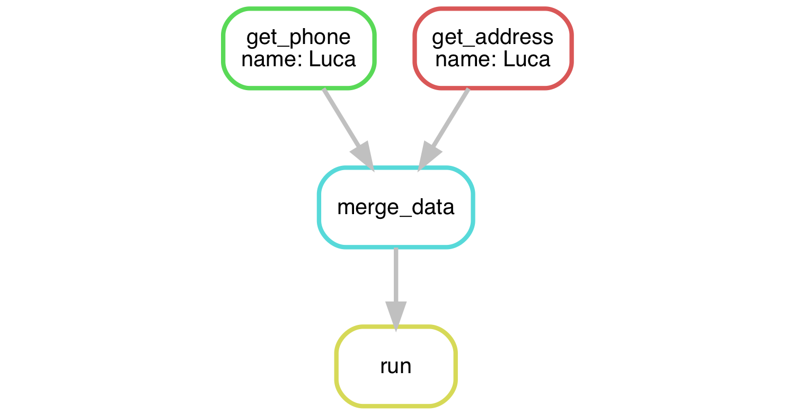
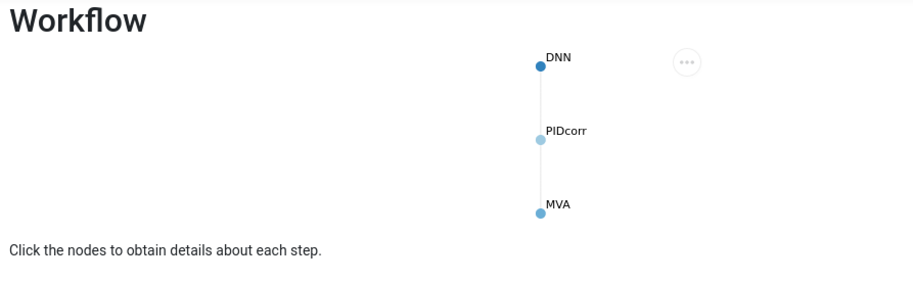
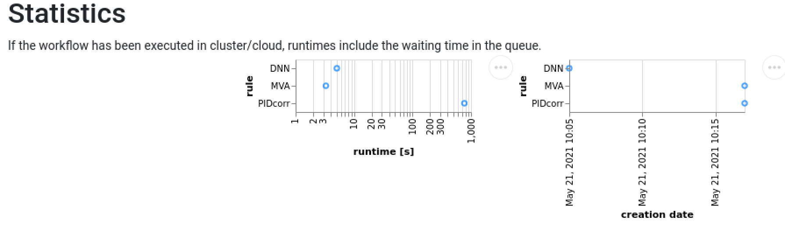
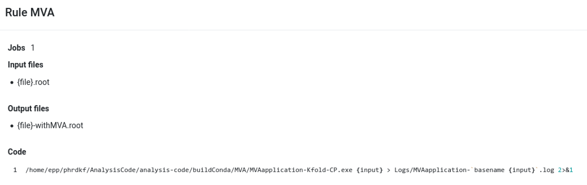

# Analysis automation with snakemake



* Learn what analysis automation is and how it helps with analysis preservation
* Learn how to create a pipeline with Snakemake



## Motivation

> “The Snakemake workflow management system is a tool to create reproducible and scalable data analyses”

* A workflow management system allows you to:
  * Keep a record of how your scripts are used and what their input dependencies are
  * Run multiple steps in sequence, parallelising where possible
  * Automatically detect if something changes and then reprocess data if needed
* Using a workflow management forces you to:
  * Keep your code and your locations in order
  * Structure your code so that it is user-independent
  * Standardise your scripts
    * Bonus: Standardised scripts can sometimes be used across analyses!

## Documentation and environments

You can find full documentation for Snakemake [at this link](https://snakemake.readthedocs.io/en/stable/index.html), you can also ask any questions you have on the [~reproducible](https://mattermost.web.cern.ch/lhcb/channels/reproducible) channel on mattermost.

Snakemake is best-run at LHCb using the `lb-conda` environment. This environment comes with very recent versions of ROOT, python, cmake, g++, snakemake, etc ready to use. To have access to `lb-conda` you must first have sourced `lb-env`. This is done by default on lxplus, otherwise it is done with `source /cvmfs/lhcb.cern.ch/lib/LbEnv`. In general it is recommended that if you are running non-lhcb software (e.g. code you've written yourself for your analysis) it should be done with `lb-conda`.



The basic `lb-conda` environment can be entered with the command `lb-conda default`, this will enter you into an interactive bash shell. There are a few other way in which `lb-conda` can be used.

`lb-conda default foo` will run a specific `foo` command (e.g. a python program) within the `lb-conda` environment and then exit. This is similar in effect to the old `lb-run`-style command.

`lb-conda default bash -c 'bash --rcfile ~/.bashrc'` will enter the `lb-conda` environment as before but will also source your `.bashrc` file (be careful to avoid conflicts if doing this).



More infomation on using `lb-conda` can be found [here](https://gitlab.cern.ch/lhcb-core/lbcondawrappers/-/blob/master/README.md).

You can now check if Snakemake is working by using `snakemake --help`.

## Tutorial

Snakemake allows you to create a set of rules, each one defining a "step" of your analysis.
The rules need to be written in a file called `Snakefile`.
For each step you need to provide:

  * The _input_: Data files, scripts, executables or any other files.
  * The expected _output_. It's not required to list all possible outputs.
  Just those that you want to monitor or that are used by a subsequent step as inputs.
  * A _command_ to run to process the input and create the output.

The basic rule is:

```python
rule myname:
    input: 'myinput1', 'myinput2'
    output: 'myoutput'
    shell: 'Some command to go from in to out'
```

An example. If you want to copy some text from a file called `input.txt` to `output.txt` you can do:

```python
rule copy:
    input: 'input.txt'
    output: 'output.txt'
    shell: 'cp input.txt output.txt'
```

You can even avoid typos by substituting variables instead of typing the filenames twice:

```python
rule merge_files:
    input: 'input_1.txt', 'input_2.txt'
    output: 'output.txt'
    shell: 'cat {input[0]} > {output} && cat {input[1]} >> {output}'
```

Input and output can also be parametrised using wildcards:

```python
rule copy_and_echo:
    input: 'input/{filename}.txt'
    output: 'output/{filename}.txt'
    shell: 'echo {wildcards.filename} && cp {input} {output}'
```

If you then make another rule with `output/a_file.txt` and `output/another_file.txt` as inputs they will be automatically created by the `copy_and_echo` rule.

```python
rule all:
     input: 'output/a_file.txt', 'output/another_file.txt'
```

This allows for rules to be reusable, for example to make a rule that can be used to process data with from different years or polarities.

Notice that:

* Inputs and outputs can be of any type
* You can provide python code after the tags. e.g. `input: glob("*.root")`
* Python functions can also be used as an input
* If a single file is used as an input/output, one can ommit the index when refering to the input/output.
* Wildcards must always be present in the output of a rule (else it wouldn't be possible to know what they should be)

Snakemake can also take an output of the previous rule as an input:

```python
rule create_file:
    output: 'test_file.txt'
    shell:
       'echo test > {output}'

rule copy_file:
    input: rules.create_file.output
    output: 'copied_test.txt'
    shell:
       'cp {input} {output}'
```




To try out download:

```bash
$ wget https://github.com/hsf-training/analysis-essentials/raw/master/snakemake/code/tutorial.tar
$ tar -xvf tutorial.tar
```

You will find one containing names and phone numbers. You can make one rule that, given a name extracts the line with the phone of that person.

To do this in a shell you can use `grep`, which is a command that lists all lines in a file containing a certain text.

```bash
$ grep ciao test.txt
ciao a tutti
```



### Usage and basic behaviour

And now that your `Snakefile` is done it's time to run! Just type

```bash
snakemake rulename_or_filename --cores 1
```


This will:
1. Check that the inputs exist
   * If inputs exists &rarr; 2)
   * If inputs do not exist or have changed snakemake will check if there is an other rule that produces them &rarr; Go back to 1)
2. Run the command you defined in `rulename_or_filename` (or the rule that generates the filename that is given) usin 1 core
3. Check that the output was actually produced.

Note, that one must specify the number of cores being used in snakemake.

Comments, which rules are run:
* If want to run a chain of rules only up to a certain point just put the name of the rule up to which you want to run on the snakemake command.
* If you want a rule to be "standalone" just do not give its input/outputs as outputs/inputs of any other rule
* It is normal practice to put as a first rule a dummy rule that only takes as inputs all the "final" outputs you want to be created by any other rule. In this way when you run just `snakemake` with no label it will run all rules (in the correct order).




In the tutorial folder you find two files containing addresses, and phone numbers.
You can make rules that, given a name, `grep` the address and phone and then one other rule to merge them into your final output file.

If we do this for “Luca”, it can be represented by the following graph:

[](img/DAG_single.png)

Which could be achieved using this shell script:

```bash
grep Luca inputs/addresses.txt > output/Luca/myaddress.txt
grep Luca inputs/phones.txt > output/Luca/myphone.txt
cat output/Luca/myaddress.txt > output/Luca/data.txt && cat output/Luca/myphone.txt >> output/Luca/data.txt
```

_But it does not have to be this, any other task is fine, be creative!_







Following on from the previous challenge use wildcards to make it so that any name can be used, such as “Fred”

```bash
snakemake output/Fred/data.txt --cores 1
```




See `Snakefile` in the `simple_solution` folder [here](code/tutorial.tar).





Comments, partial running:

* If part of the input is already present and not modified the corresponding rule will not run
Note that if you put your code into the inputs snakemake will detect when your code changes and automatically rerun the corresponding rule!
* If you want to force running all rules even if part of the output is present use `snakemake --forceall`
* If you want to check the snakemake rules chain without actually running them use `snakemake -n`



In the previous example try deleting one of the intermediate files, rerun snakemake and see what happens







Snakemake provides a lot of utils functions, some of the most common ones are described here.
* `expand` : returns a python list that is filled according to the possible wildcards values.
For example, an python expression `['output/{}/file.txt'.format(name) for name in names]` can be replaced with `expand('output/{name}/file.txt', name = names)` in the inputs.
* `temp`: specifies that the output file is temporary. For example, `temp('file.root')` will be deleted as the last rule that uses it as an input has finished.
* `directory`: specifies that the output is a directory rather than a file. For example, `directory('output/plots')`. Snakemake 6+ will not create this directory automatically, as it happens with the output files. One way around it is to have a `mkdir` in the `shell` before excuting the main command or having a special rule that creates all necessary directories. Note, that when the snakemake rule falls all outputs are being deleted including the directories.



### Sub-labels

Inside the pre-defined tags you can add custom subtags as in this example.

```python
rule run_some_py_script:
    input:
        exe = 'myscript.py',
        data = 'mydata.root',
        extra = 'some_extra_info.txt',
    output: 'output.txt'
    shell: 'python {input.exe} {input.data} --extra {input.extra} > {output}'
```

So this will effectively launch the command:

```bash
python myscript.py mydata.roo --extra some_extra_info.txt > output.txt
```

The `--extra` is not necessary. It's just to illustrate how python scripts options can be used.



Add your python script to the inputs than make some modifications to it, rerun snakemake and see what happens.




### Run and shell

You have two ways to specify commands. One is `shell` that assumes shell commands as shown before.
The other is `run` that instead directly takes python code (Careful it's python3!).

For example the copy of the file as in the previous example can be done in the following way.

```python
rule dosomething_py:
    input: 'myfile.txt'
    output: 'myoutput.txt'
    run:
        with open(str(input), 'rt') as fi:
            with open(str(output), 'wt') as fo:
                fo.write(fi.read())
```

And finally you can mix! Namely you can send shell commands from python code.
This is useful, in particular if you have to launch the same shell command on more inputs.

```python
rule dosomething_pysh:
    input:
        code = 'mycode.exe',
        data = ['data1.root', 'data2.root']
    output: 'plot1.pdf', 'plot2.pdf'
    run:
        for f in input.data:
            shell('./{input.code} %s' % f)
```
Note the list brackets in the `output.data` to highlight the fact that the data output is a list.
If the brackets were absent, snakemake would not allow this rule to run, assuming that the `"data2.root"` is the next positional output.
In snakemake positional inputs/outputs have to be positioned before the keyword (labeled) inputs/outputs.



Rewrite your previous file using a python script to run the search and use `run` to run on both phones and addresses in the same rule



An example solution can be found [here](code/Snakefile).
Although it's fine if you have done it a different way.





### Config files

Often you want to run the same rule on different sample or with different options for your scripts.
This can be done in snakemake using config files written in [yaml](https://learn.getgrav.org/advanced/yaml).

For example let's put the datafiles in a cfg.yaml file

```python
data:
    - 'data1.root'
    - 'data2.root'
```

Now in your Snakefile you can load this config file and then its content will be available into the rules as a dictionary called "config". Yes, it seems black magic, but it works! Your Snakefile will look like this

```python
configfile: '/path/to/cfg.yaml'

rule dosomething_pysh:
    input:
        code = 'mycode.exe',
        data = config['data'],
    output: ['plot1.pdf', 'plot2.pdf']
    run:
        for f in input:
            shell('./{input.code} %s' % f)
```

The config dictionary can be used anywhere, also inside the shell command or even outside a rule.



Put the inputs of your script into a config file



### Includes

The Snakefile can quickly grow to a monster with tens of rules. For this reason it's possible to split them into more files and then include them into the Snakefile. For example you might have a `fit_rules.snake` and `efficiency_rules.snake` and then your Snakefile will look like this:

```python
include: /path/to/fit_rules.snake
include: /path/to/efficiency_rules.snake
```

The order of the includes is irrelevant.



Move your rules to other files and include them




You can find a solution in the `more_complete_solution` folder, which you can find [here](code/tutorial.tar).





### Reports

As well as executing rules snakemake is also able to produce _reports_. These are html files and can contain information such as a diagramisation of your DAG as well as statistics about the run time of your rules and summaries of your outputs. To include a file in the report simply add the `report` flag to it e.g.

```python
rule myRule:
	input:
 		SomeFile.root
	output:
 		report(Output.pdf) # this will now be included in the report
	shell:
  		python RuleForExecution.py {input}
```

N.B. the reporting feature does not work with files already marked as `temp`

To produce the report you first run the `snakemake` command as you normally would.
Then run the exact same command again adding the `--report` flag as the first argument to your snakemake command.

A command such as `snakemake --report report.html` will produce a report containing everything.
By constrast `snakemake fig1.pdf --report report-short.html` will produce a short report of just that one target.

Some screenshots of what a report may look like are shown below. Information in the report includes: a graph showing the DAG of the completed jobs, each node of this graph can be clicked to show the rule in more detail; the time taken to run each job; and a summary of all the produced files.

Ideally every plot which is included in an ana note would have a report explaining how it was made.

[](img/Reporting_DAG.png)
[](img/Reporting_stats.png)
[](img/Reporting_rule.png)

For more information on using reports as well as more examples, see the snakemake documentation [here](https://snakemake.readthedocs.io/en/stable/snakefiles/reporting.html).

<!-- TODO add this section once the linked page is finished
### Workflow preservation

https://lhcb-dpa.web.cern.ch/lhcb-dpa/wp6/workflow-preservation.html
-->
